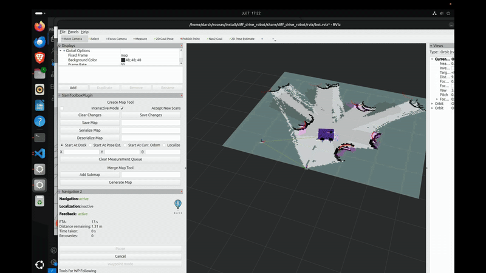
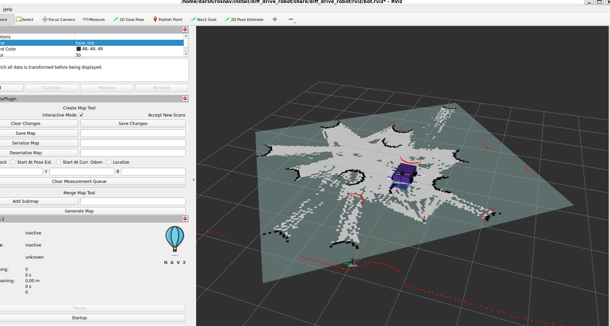
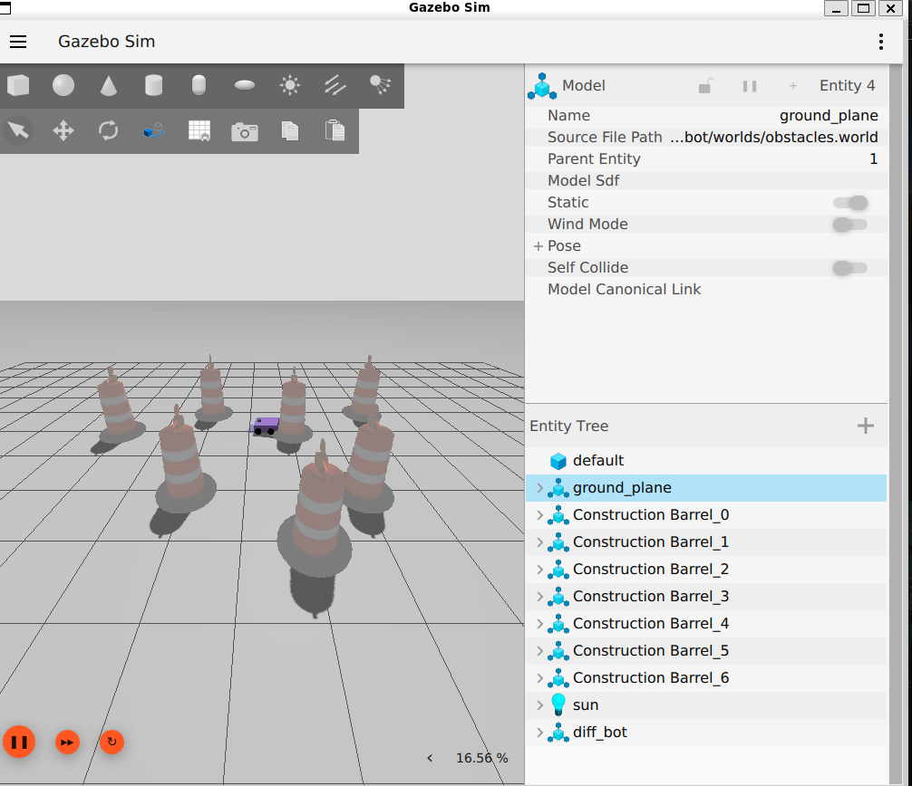

# ROS 2 Navigation and SLAM with Nav2 and Gazebo Harmonic

## Overview

This project utilizes **Nav2** and **SLAM Toolbox** for robot navigation and obstacle avoidance in a simulated environment. The robot autonomously detects obstacles and adjusts its path to avoid collisions while leveraging **Gazebo Harmonic** for realistic simulations and **ROS 2 Jazzy** for communication and control.
 



## Features

* **Obstacle Avoidance**: The robot automatically detects obstacles and adjusts its trajectory to avoid collisions.
* **Simulation Environment**: Uses **Gazebo Harmonic** for high-fidelity simulations.
* **Visualization**: RViz support for real-time sensor data and path visualization.

## Requirements

### Operating System:

* **Ubuntu 24.04** (Recommended)

### ROS Distribution:

* **ROS 2 Jazzy**

### Simulator:

* **Gazebo Harmonic**

## Installation

### Add ROS 2 Jazzy Repository (if not already added)

If the ROS 2 Jazzy packages are not found, you might need to add the ROS 2 repository. Use the following commands:

```bash
sudo apt update
sudo apt install curl gnupg2 lsb-release
curl -sSL https://raw.githubusercontent.com/ros/rosdistro/master/ros.key | sudo apt-key add -
sudo sh -c 'echo "deb [arch=amd64] http://packages.ros.org/ros2/ubuntu $(lsb_release -cs) main" > /etc/apt/sources.list.d/ros2-latest.list'
```

Afterward, update your package lists:

```bash
sudo apt update
```

### Install Required ROS 2 Packages

Make sure to install the following ROS 2 Jazzy packages:

```bash
sudo apt-get update
sudo apt install -y \   
   ros-jazzy-ros-gz \  
   ros-jazzy-ros-gz-bridge \  
   ros-jazzy-joint-state-publisher \  
   ros-jazzy-xacro \  
   ros-jazzy-teleop-twist-keyboard \  
   ros-jazzy-teleop-twist-joy \  
   ros-jazzy-nav2-bringup \  
   ros-jazzy-slam-toolbox \
   ros-jazzy-navigation2
```

### Create a ROS 2 Workspace (if you don’t already have one)

```bash
mkdir -p ~/roscar/src
cd ~/roscar
colcon build --symlink-install
```

### Clone This Repository into the Workspace

```bash
cd ~/roscar/src
git clone https://github.com/darshmenon/rosnav.git
```

(The repository will be cloned into a folder named `rosnav`.)

### Build the Workspace

```bash
cd ~/roscar
colcon build --symlink-install
```

### Source Your Workspace

```bash
source ~/roscar/install/setup.bash
```

### Verify ROS 2 Packages Installation

Ensure that the ROS 2 packages are available and installed correctly. Use the following command to list installed packages:

```bash
ros2 pkg list | grep ros-gz
ros2 pkg list | grep teleop
```

## Running Navigation and SLAM

### Important Configuration Step

Before running Nav2 and SLAM, update the `mapper_params_online_async.yaml` file with the correct path to your map file. Replace the existing `map_file_name` entry with the path to your map location. For example:

```yaml
map_file_name: /home/darsh/ros2/my_map_serial
```

This change should be made in `src/diff_drive_robot-main/config/mapper_params_online_async.yaml`.

### Start Navigation with Nav2

To launch the navigation stack:

```bash
ros2 launch diff_drive_robot robot.launch.py
```

Once Nav2 is running, set the navigation goal pose in **RViz**.

### Run SLAM and Generate a Map

To start SLAM and generate a map:

```bash
ros2 launch diff_drive_robot slam.launch.py
```

(SLAM must be running for Nav2 to work.)

## Manual Robot Control

If you prefer manual control, use the keyboard teleoperation tool:

```bash
ros2 run teleop_twist_keyboard teleop_twist_keyboard
```

This allows you to control the robot using the arrow keys.

## Goal Setting (Alternative Method)

Alternatively, you can modify `robot.launch.py` to comment out the navigation node and manually set navigation goals.
Set your target destination directly in the navigation script `navigation.py`. For example, to set the goal at `x = 5.0` and `y = 4.0`, modify the script:

```python
   self.goal = [5.0, 4.0]  
```

## Troubleshooting

If you encounter issues with missing ROS 2 packages like `ros-jazzy-ros-gz`, it’s possible the packages are not available through the default apt repository. In such cases:

1. Ensure the ROS 2 Jazzy repositories are properly added to your system.
2. If packages are missing, build from source by cloning the relevant repositories into your workspace.

## Contributing

Feel free to contribute to this project by submitting issues or pull requests.

