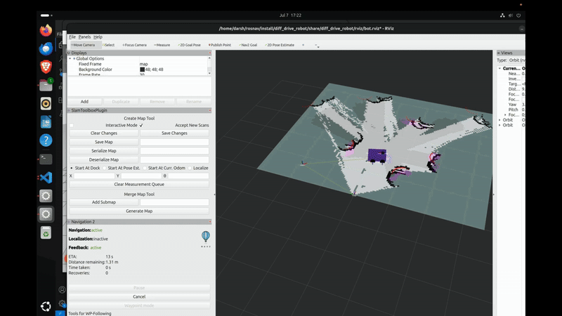
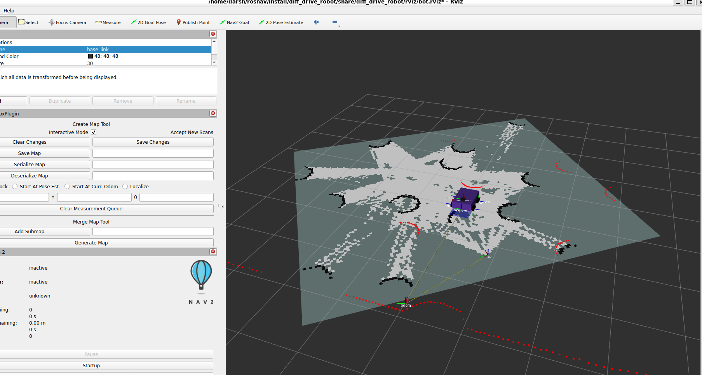

# ROS 2 Navigation and SLAM with Nav2 and Gazebo Harmonic

📖 **Related Blog Post**:
👉 [*Mastering ROS 2 Navigation: From SLAM Mapping to Autonomous Obstacle Avoidance*](https://medium.com/@darshmenon02/mastering-ros-2-navigation-from-slam-mapping-to-autonomous-obstacle-avoidance-7446e4ff049a)

## Overview

Autonomous robot navigation using **Nav2**, **SLAM Toolbox**, and **Gazebo Harmonic**. Includes frontier-based exploration, waypoint following, multi-robot support, and 2D LiDAR. Works on **ROS 2 Humble and Jazzy** — distro is detected automatically at launch.




---

## ⚠️ Humble vs Jazzy — Automatic Params Selection

Nav2 plugin naming differs between distros. **The launch files detect `$ROS_DISTRO` automatically** and pick the right config:

| Distro | Params file used | Plugin format |
|---|---|---|
| **Humble** (default) | `config/nav2_params.yaml` | `nav2_behaviors/Spin` |
| **Jazzy** | `config/nav2_params_jazzy.yaml` | `nav2_behaviors::Spin` |

> No manual changes needed — just `source /opt/ros/<distro>/setup.bash` before launching.
> If `$ROS_DISTRO` is missing, launch files fall back to **Humble** params.

---

## Features

- **SLAM live mapping** — SLAM Toolbox builds map while navigating
- **Frontier exploration** — robot autonomously explores unknown areas
- **Nav2 full stack** — planner, controller, recovery, behaviours
- **Multi-robot (scalable)** — N robots sharing one SLAM-built map with per-robot frontier exploration
- **Waypoint following** — navigate a sequence of poses
- **2D LiDAR** — native LaserScan, no conversion needed for Nav2/SLAM
- **Complex worlds** — obstacles world and maze world included

---

## Requirements

| | Humble | Jazzy |
|---|---|---|
| OS | Ubuntu 22.04 | Ubuntu 24.04 |
| Gazebo | Harmonic | Harmonic |

---

## Installation

```bash
# Replace 'humble' with 'jazzy' on Ubuntu 24.04
sudo apt install -y \
  ros-humble-ros-gz ros-humble-ros-gz-bridge \
  ros-humble-xacro ros-humble-joint-state-publisher \
  ros-humble-nav2-bringup ros-humble-slam-toolbox \
  ros-humble-navigation2 ros-humble-teleop-twist-keyboard

mkdir -p ~/rosnav/src && cd ~/rosnav/src
git clone https://github.com/darshmenon/rosnav.git
cd ~/rosnav && colcon build --symlink-install
source ~/rosnav/install/setup.bash
```

---

## Running

All maps are automatically saved to and loaded from `src/diff_drive_robot-main/maps/` based on the world name.

### Mode 1 — Autonomous frontier exploration (Auto-maps)
Run SLAM, Gazebo, RViz, and the Frontier Explorer all in a **single command**. The robot will explore the maze and progressively save the map (`map_maze.yaml`) every 15 seconds.
```bash
ros2 launch diff_drive_robot slam_nav.launch.py world_name:=maze explore:=true
```

### Mode 2 — SLAM live mapping + Nav2 (Manual Control)
If you want to manually drive and build the map yourself:
```bash
ros2 launch diff_drive_robot slam_nav.launch.py world_name:=maze
```
*(You can manually run `ros2 run diff_drive_robot frontier_explorer.py` later if desired)*

### Maze world quick launch (recommended)
```bash
ros2 launch diff_drive_robot slam_nav.launch.py world_name:=maze rviz:=True
```
Notes:
- Default robot entity name is `diff_drive`.
- Default maze spawn is set to a safer visible area.
- If you still do not see the robot, run with explicit spawn:
```bash
ros2 launch diff_drive_robot slam_nav.launch.py world_name:=maze \
  spawn_x:=1.5 spawn_y:=1.0 spawn_z:=0.3 spawn_yaw:=0.0
```

### Mode 3 — Saved map + AMCL localisation
Once the map is saved into the `maps/` directory, you can load the environment in localisation-only mode (no SLAM). It will automatically find `map_maze.yaml` if you use `world_name:=maze`:
```bash
ros2 launch diff_drive_robot robot.launch.py world:=/full/path/to/maze.world
```

### Mode 4 — Multi-Robot Navigation (Scalable)
Launch N robots in the maze, sharing a SLAM-built map. Each robot runs its own
frontier explorer independently. Default is SLAM + exploration in the maze world:
```bash
# SLAM + frontier exploration (default — no pre-built map needed)
ros2 launch diff_drive_robot multi_robot.launch.py

# Pre-built map mode
ros2 launch diff_drive_robot multi_robot.launch.py explore:=false

# Different world with pre-built map
ros2 launch diff_drive_robot multi_robot.launch.py world:=obstacles explore:=false
```

To add more robots, edit the `ROBOTS` list in `multi_robot.launch.py` — no other files change:
```python
ROBOTS = [
    {'name': 'robot1', 'x': '-2.0', 'y': '-1.0', 'z': '0.3', 'yaw': '0.0'},
    {'name': 'robot2', 'x': '-0.8', 'y': '-1.0', 'z': '0.3', 'yaw': '0.0'},
    {'name': 'robot3', 'x':  '0.5', 'y': '-1.0', 'z': '0.3', 'yaw': '0.0'},
]
```

### 3D LiDAR Setup
The robot URDF supports both 2D and 3D LiDARs. To use the 3D LiDAR:
1. Edit `urdf/robot.urdf.xacro` and change `<xacro:include filename="lidar.xacro" />` to `<xacro:include filename="lidar3d.xacro" />`.
2. Since Nav2 expects 2D `LaserScan` messages on `/scan`, but the 3D LiDAR outputs `PointCloud2` on `/points`, you must run the `pointcloud_to_laserscan` node converter alongside your launch files:
```bash
sudo apt install ros-$ROS_DISTRO-pointcloud-to-laserscan
ros2 run pointcloud_to_laserscan pointcloud_to_laserscan_node \
    --ros-args -r cloud_in:=/points -r scan:=/scan \
    -p min_height:=0.1 -p max_height:=1.0 -p angle_min:=-1.57 -p angle_max:=1.57
```

### Custom maps
To force load a custom map file:
```bash
ros2 launch diff_drive_robot robot.launch.py map:=/full/path/to/my_custom_map.yaml
```
To use a custom world file and optionally specify a map save prefix:
```bash
ros2 launch diff_drive_robot slam_nav.launch.py world:=/full/path/to/world.world map_prefix:=/tmp/custom_map
```

### Verify multi-robot
```bash
# Both robots spawned
ros2 topic list | grep -E "/robot1|/robot2"

# Shared map (SLAM or map_server)
ros2 topic hz /map

# Send goals to individual robots
ros2 action send_goal /robot1/navigate_to_pose nav2_msgs/action/NavigateToPose \
  "{pose: {header: {frame_id: map}, pose: {position: {x: -1.5, y: -0.5}, orientation: {w: 1.0}}}}"

ros2 action send_goal /robot2/navigate_to_pose nav2_msgs/action/NavigateToPose \
  "{pose: {header: {frame_id: map}, pose: {position: {x: 0.0, y: -0.5}, orientation: {w: 1.0}}}}"
```

### 3D LiDAR test (PointCloud2 + Nav2 compatibility)
This project publishes 3D LiDAR on `/points` (PointCloud2). Nav2 needs `/scan` (LaserScan), so run conversion:
```bash
ros2 run pointcloud_to_laserscan pointcloud_to_laserscan_node \
  --ros-args -r cloud_in:=/points -r scan:=/scan \
  -p target_frame:=base_link -p min_height:=0.0 -p max_height:=1.0
```
Useful tuning params from `pointcloud_to_laserscan`: `angle_min`, `angle_max`, `angle_increment`, `range_min`, `range_max`, `transform_tolerance`.

Smoke test commands:
```bash
# Check point cloud stream exists
ros2 topic hz /points

# Inspect one point cloud message
ros2 topic echo /points --once

# After conversion, confirm scan exists for Nav2/SLAM
ros2 topic hz /scan
```

---

## Keyboard Control

```bash
ros2 run teleop_twist_keyboard teleop_twist_keyboard
```

---

## Troubleshooting

| Symptom | Fix |
|---|---|
| `FATAL: plugin X does not exist` | Wrong distro params — check `$ROS_DISTRO` is sourced correctly |
| Map not saving correctly | Ensure `explore:=true` is set. Maps save to `src/diff_drive_robot-main/maps/` |
| Frontier says `No frontiers` repeatedly | Check SLAM logs for `TF_OLD_DATA` / dropped scans and kill stale Gazebo/ROS processes before relaunch |
| Robot not moving | Run `ros2 topic hz /cmd_vel` — if 0, Nav2 lifecycle failed; check node list |
| Multi-robot robots not visible in Gazebo | Ensure you have sourced and rebuilt after the latest fixes (`colcon build --symlink-install`) |
| Multi-robot TF errors | Confirm RSP `frame_prefix` fix is applied (`rsp.launch.py`). Run `ros2 run tf2_tools view_frames` to inspect the tree |
| RViz GLSL errors | Cosmetic only, can be ignored |

---

## Contributing

Issues and pull requests welcome.
