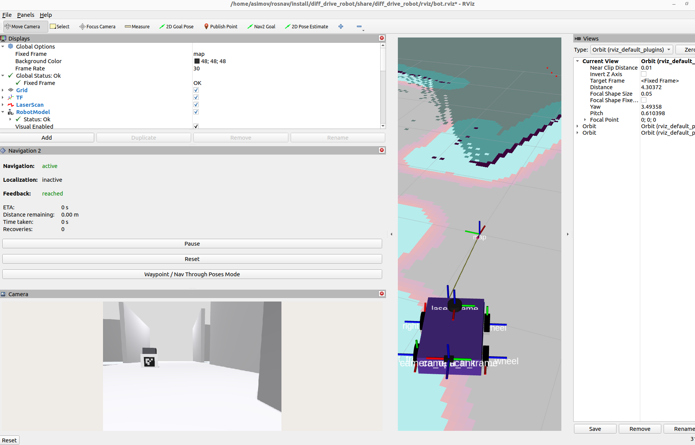

<div align="center">

# ROS 2 Autonomous Navigation Stack

### SLAM · Nav2 · Multi-Robot · Frontier Exploration · Fleet Management

[](https://docs.ros.org/en/humble/)
[](https://gazebosim.org/)
[](LICENSE)
[](https://medium.com/@darshmenon02/mastering-ros-2-navigation-from-slam-mapping-to-autonomous-obstacle-avoidance-7446e4ff049a)

<br/>

**Nav2 + SLAM in Gazebo — single command**

```bash
ros2 launch rosnav_bot slam_nav.launch.py world_name:=hospital explore:=true
```


<p><sub>Single-robot SLAM · Nav2 · frontier exploration</sub></p>

</div>

One launch → Gazebo + SLAM/Nav2 + RViz. Scale to a fleet with one arg. Humble/Jazzy params auto-selected from `$ROS_DISTRO`.

Deep dive → [`concepts.md`](concepts.md) · launch args → `ros2 launch rosnav_bot <file> --show-args`

---

## 1. Install

```bash
# Ubuntu 22.04 / Humble — use jazzy on 24.04
sudo apt install -y \
  ros-humble-ros-gz ros-humble-ros-gz-bridge \
  ros-humble-xacro ros-humble-joint-state-publisher \
  ros-humble-nav2-bringup ros-humble-slam-toolbox \
  ros-humble-navigation2 ros-humble-teleop-twist-keyboard \
  ros-humble-laser-filters ros-humble-rviz2

git clone https://github.com/darshmenon/rosnav.git ~/rosnav
cd ~/rosnav && colcon build --symlink-install
source /opt/ros/humble/setup.bash && source install/setup.bash
```

---

## 2. Map · save · navigate

### A — Drive with teleop (build the map)

```bash
# Terminal 1 — SLAM only (no frontier). Keep safety:=true so /cmd_vel reaches Gazebo.
ros2 launch rosnav_bot slam_nav.launch.py world_name:=hospital

# Terminal 2 — keyboard drive
ros2 run teleop_twist_keyboard teleop_twist_keyboard
```

Keys: `i` forward · `,` back · `j`/`l` turn · `k` stop · `q`/`z` speed.  
Watch the map in RViz (`Map` on `/map`), or:

```bash
ros2 topic hz /scan          # ~10 Hz
ros2 topic hz /odom          # ~50 Hz
ros2 topic echo /map --once --field info    # width/height should grow
```

Or let the robot explore alone: add `explore:=true` to the launch above.

### B — Save the map

```bash
ros2 run nav2_map_server map_saver_cli -f src/rosnav_bot/maps/map_hospital
```

Writes `map_hospital.yaml` + `map_hospital.pgm`. Then `Ctrl+C` the SLAM launch.  
(With `explore:=true`, maps also autosave under `src/rosnav_bot/maps/map_<world>.*`.)

### C — Navigate on the saved map

```bash
ros2 launch rosnav_bot robot.launch.py world_name:=hospital \
  map:=src/rosnav_bot/maps/map_hospital.yaml
```

AMCL localizes on the static map — no more SLAM. Send a goal:

**RViz**  
1. Fixed Frame = `map`  
2. **2D Pose Estimate** — seed AMCL if particles are wide  
3. **2D Goal Pose** — click+drag the goal  

**CLI**
```bash
ros2 action send_goal /navigate_to_pose nav2_msgs/action/NavigateToPose \
  "{pose: {header: {frame_id: map}, pose: {position: {x: 2.0, y: -1.0}, orientation: {w: 1.0}}}}"

ros2 run rosnav_bot fleet_manager.py goto '' 2.0 -1.0    # single robot
ros2 run rosnav_bot fleet_manager.py goto robot1 room_a  # named location
```

Goal accepted but no motion? Keep `safety:=true` (Nav2 `/cmd_vel` → Gazebo `/cmd_vel_safe`).

Multi-SLAM (`slam_mode:=multi`): save `/map_merged` with `-t /map_merged` or `fleet_manager.py savemap`.

---

## 3. Fleet & explore

```bash
ros2 launch rosnav_bot slam_nav.launch.py world_name:=hospital explore:=true
ros2 launch rosnav_bot multi_robot.launch.py robot_count:=2
ros2 launch rosnav_bot multi_robot.launch.py fleet_mgmt:=true
ros2 launch rosnav_bot multi_robot.launch.py slam_mode:=multi      # → /map_merged
ros2 launch rosnav_bot multi_robot.launch.py merge_scans:=true     # → /map_fused

ros2 launch rosnav_bot slam_nav.launch.py world_name:=hospital safety:=true
ros2 run rosnav_bot mission_server.py patrol robot1 1,2,0 3,4,90
ros2 run rosnav_bot coverage_planner.py
```

---

## 4. YOLO object detection

Needs: `pip install ultralytics`. Camera is enabled automatically with `enable_yolo:=true`.

```bash
ros2 launch rosnav_bot slam_nav.launch.py world_name:=warehouse enable_yolo:=true

# Tune
ros2 launch rosnav_bot slam_nav.launch.py world_name:=warehouse enable_yolo:=true \
  yolo_model:=yolov8n.pt yolo_confidence:=0.6 yolo_classes:=person,chair
```

Topics: `yolo/detections` · `yolo/image_annotated`

---

<p align="center">
  
  <br/><sub>ArUco visual docking</sub>
</p>

## 5. ArUco docking

Needs: `enable_camera:=true` and `sudo apt install ros-humble-cv-bridge python3-opencv`. Hospital world has the dock marker.

```bash
ros2 launch rosnav_bot slam_nav.launch.py world_name:=hospital enable_camera:=true rviz:=true

ros2 run rosnav_bot fleet_manager.py dock '' charging_dock
ros2 run rosnav_bot fleet_manager.py undock '' 0.5 0.05

# Visual approach only (skip Nav2 staging)
ros2 run rosnav_bot aruco_dock.py --ros-args -p dock_name:=charging_dock
```

Dock poses / marker IDs → `config/docks.yaml`. Live view: `/tmp/aruco_dock_view.jpg` or RViz `Image` on `/camera/image_raw`.

---

## 6. LLM voice navigation

Needs: `ollama serve` and a pulled model (`ollama pull llama2`). Start the nav stack first.

```bash
ros2 launch rosnav_bot slam_nav.launch.py world_name:=hospital

ros2 run rosnav_bot llm_nav.py
# type or speak: go to room_b · go to 2.5 1.0 · stop

# Text only (no mic)
ros2 topic pub /llm_nav/command std_msgs/msg/String "data: 'go to room_a'" --once
```

Named places → `config/locations.yaml`.

---

## 7. Drive bases & controllers

```bash
# Diff (default) · holonomic · car-like
ros2 launch rosnav_bot slam_nav.launch.py world_name:=hospital drive_type:=diff explore:=true
ros2 launch rosnav_bot slam_nav.launch.py world_name:=hospital drive_type:=mecanum explore:=true
ros2 launch rosnav_bot slam_nav.launch.py world_name:=hospital drive_type:=ackermann explore:=true safety:=true

# Fleet-wide
ros2 launch rosnav_bot multi_robot.launch.py drive_type:=mecanum
ros2 launch rosnav_bot multi_robot.launch.py drive_type:=ackermann

# MPPI instead of DWB (Humble; Jazzy already defaults to MPPI)
ros2 launch rosnav_bot slam_nav.launch.py world_name:=hospital controller:=mppi explore:=true

# 3D lidar / RTAB-Map · MiR100 visual chassis
ros2 launch rosnav_bot slam_nav.launch.py lidar_type:=3d
ros2 launch rosnav_bot slam_nav.launch.py lidar_type:=3d slam_algo:=3d explore:=true
ros2 launch rosnav_bot slam_nav.launch.py robot_model:=mir100
```

Strafe example (mecanum):
```bash
ros2 topic pub -r 20 /cmd_vel_safe geometry_msgs/msg/Twist \
  "{linear: {x: 0.0, y: 0.3, z: 0.0}, angular: {x: 0.0, y: 0.0, z: 0.0}}"
```

---

## 8. Open-RMF (experimental)

```bash
ros2 launch rosnav_bot multi_robot.launch.py explore:=false robot_count:=2
ros2 launch rosnav_bot rmf_fleet.launch.py robot_count:=2 docking:=noop
ros2 run rosnav_bot rmf_submit_task.py patrol room_a room_b --rounds 2
```

Details → [concepts.md §11b](concepts.md#11b-open-rmf-traffic-scheduling-experimental).

---

<p align="center">
  
  <br/><sub>Multi-robot coordinated exploration</sub>
</p>

## 9. Fleet CLI

```bash
ros2 run rosnav_bot fleet_manager.py list|status|health
ros2 run rosnav_bot fleet_manager.py goto robot1 room_a
ros2 run rosnav_bot fleet_manager.py teleop robot1
ros2 run rosnav_bot fleet_manager.py savemap src/rosnav_bot/maps/map_hospital
ros2 run rosnav_bot fleet_manager.py mission robot1 patrol room_a room_b
ros2 run rosnav_bot fleet_manager.py tasks add 2.0 1.5 0 pickup_A
ros2 run rosnav_bot fleet_gui.py
ros2 run rosnav_bot multi_teleop.py
```

---

## 10. Worlds

| | |
|---|---|
| Indoor | `hospital` `house` `office` `warehouse` `maze` `corridor` `obstacles` |
| Special | `empty` · `warehouse_depot` (`scripts/download_depot_model.sh` if needed) |
| No map yet | `outdoor` `multi_terrain` — use `explore:=true` |

```bash
ros2 launch rosnav_bot slam_nav.launch.py world_name:=warehouse explore:=true
ros2 launch rosnav_bot multi_robot.launch.py world:=house
```

---

<p align="center">
  
  <br/><sub>Dock approach in map / TF view</sub>
</p>

## 11. Update YAML (tuning)

All configs live under `src/rosnav_bot/config/`. With `--symlink-install`, edit then **relaunch** (no rebuild).

| Want to change… | Edit |
|---|---|
| Named places (`room_a`, `goto`) | `locations.yaml` |
| ArUco dock ID / staging / stand-off | `docks.yaml` |
| Nav2 speeds, footprint, costmaps (diff, Humble) | `nav2_params.yaml` |
| Same on Jazzy | `nav2_params_jazzy.yaml` |
| MPPI / mecanum / ackermann | `nav2_params_mppi.yaml` · `nav2_params_mecanum.yaml` · `nav2_params_ackermann.yaml` |
| Multi-robot Nav2 | `nav2_multirobot_params.yaml` (+ `_jazzy`) |
| SLAM Toolbox | `mapper_params_online_async.yaml` · `mapper_params_per_robot.yaml` |
| RMF lanes / fleet policy | `rmf_fleet.yaml` |
| Keep-out zones | `no_go_zones.yaml` |

```bash
# locations.yaml — then: ros2 run rosnav_bot fleet_manager.py goto '' kitchen
#   kitchen: {x: 3.0, y: -1.5, yaw: 0.0}

# nav2_params.yaml — raise speed:
#   controller_server → FollowPath → max_vel_x: 0.5

source install/setup.bash
ros2 launch rosnav_bot slam_nav.launch.py world_name:=hospital explore:=true
```

Maps: `src/rosnav_bot/maps/map_<world>.yaml` (+ `.pgm`) · use `map:=...` on launch.  
More → [`concepts.md`](concepts.md).

---

## 12. Fixes

| Problem | Try |
|---|---|
| Plugin FATAL | Source the right `$ROS_DISTRO` |
| No motion | `ros2 topic hz /cmd_vel` · keep `safety:=true` |
| Map not saved | `explore:=true` · multi-SLAM: `-t /map_merged` |
| TF / no frontiers | Kill stale `gz` / `ros2` processes |
| Invisible robots | `colcon build --symlink-install && source install/setup.bash` |
| YAML change ignored | Symlink install + relaunch; edit the correct Humble/Jazzy / drive-type file |
| Dock sees nothing | Set `enable_camera:=true` |
| YOLO missing | `pip install ultralytics` |
| LLM fails | `ollama serve` + `ollama pull llama2` |

---

```
Fleet mgmt  →  Nav2 + SLAM/AMCL  →  Gazebo Harmonic + ros-gz bridge
```

<div align="center">

Made by [@darshmenon](https://github.com/darshmenon) · [Blog](https://medium.com/@darshmenon02/mastering-ros-2-navigation-from-slam-mapping-to-autonomous-obstacle-avoidance-7446e4ff049a) · [concepts.md](concepts.md)

</div>
