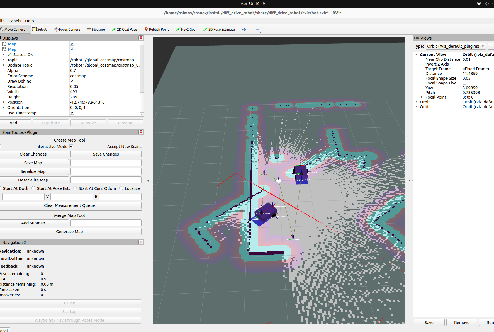

<div align="center">

# ROS 2 Autonomous Navigation Stack

### SLAM · Nav2 · Multi-Robot · Frontier Exploration · Fleet Management

[](https://docs.ros.org/en/humble/)
[](https://gazebosim.org/)
[](LICENSE)
[](https://medium.com/@darshmenon02/mastering-ros-2-navigation-from-slam-mapping-to-autonomous-obstacle-avoidance-7446e4ff049a)


</div>

---

## What is this?

A full autonomous robot navigation stack built on **Nav2**, **SLAM Toolbox**, and **Gazebo Harmonic**. Single command launches everything — Gazebo, SLAM, Nav2, RViz, frontier exploration. Scale from one robot to a fleet by editing a single list.

**Distro detection is automatic.** Source your ROS install and launch — no config changes needed between Humble and Jazzy.

---

## Table of Contents

- [Features](#features)
- [Requirements](#requirements)
- [Installation](#installation)
- [Quick Start](#quick-start)
- [All Launch Modes](#all-launch-modes)
- [Fleet Management](#fleet-management)
- [Open-RMF Traffic Scheduling](#open-rmf-traffic-scheduling-experimental)
- [Worlds](#worlds)
- [Troubleshooting](#troubleshooting)

---

## Features

<table>
<tr>
<td width="50%">

**Core Navigation**
- SLAM Toolbox live mapping
- Nav2 full stack, recovery BT — controller/planner defaults are distro-dependent: Humble defaults to DWB + NavFn, Jazzy defaults to MPPI + Smac Hybrid
- Swappable local controller on Humble: `controller:=dwb` (default) or `controller:=mppi`
- Frontier-based autonomous exploration
- Waypoint following
- Custom Behavior Tree (backup→spin→clear→wait)
- Swappable drive base — diff-drive, holonomic mecanum (`drive_type:=mecanum`), or car-like Ackermann (`drive_type:=ackermann`)

</td>
<td width="50%">

**Multi-Robot Fleet**
- N robots, one SLAM-built shared map
- Coordinated frontier assignment — no duplicate effort
- Namespaced TF per robot (`robot1/odom`, `robot1/base_link`)
- Headless mode for SSH / CI
- Hungarian task allocation across idle robots

</td>
</tr>
<tr>
<td>

**Safety Stack**
- Collision Monitor — stop/slowdown zones from live scan
- Priority collision avoidance between robots
- Deadlock detection and automatic recovery
- Dynamic obstacle tracker with MarkerArray output

</td>
<td>

**Tooling**
- Fleet CLI (`fleet_manager.py`) — list, teleop, goto, savemap, health
- Fleet GUI (Tkinter) — click-to-navigate, velocity sliders
- Multi-robot keyboard teleop with robot switcher
- Coverage path planner (boustrophedon sweep)
- Fleet health monitor at 1 Hz on `/fleet/health`

</td>
</tr>
</table>

---

## Requirements

| | Humble | Jazzy |
|---|---|---|
| OS | Ubuntu 22.04 | Ubuntu 24.04 |
| Gazebo | Harmonic | Harmonic |

> Nav2 plugin syntax differs between distros. Launch files detect `$ROS_DISTRO` automatically and pick the right params — no manual changes needed.

---

## Installation

```bash
# Replace humble with jazzy on Ubuntu 24.04
sudo apt install -y \
  ros-humble-ros-gz ros-humble-ros-gz-bridge \
  ros-humble-xacro ros-humble-joint-state-publisher \
  ros-humble-nav2-bringup ros-humble-slam-toolbox \
  ros-humble-navigation2 ros-humble-teleop-twist-keyboard

mkdir -p ~/rosnav/src && cd ~/rosnav/src
git clone https://github.com/darshmenon/rosnav.git
cd ~/rosnav
colcon build --symlink-install
source install/setup.bash
```

---

## Quick Start

```bash
# Explore the hospital — SLAM + Nav2 + frontier explorer in one command
ros2 launch diff_drive_robot slam_nav.launch.py world_name:=hospital explore:=true

# Multi-robot fleet (2 robots, coordinated exploration)
ros2 launch diff_drive_robot multi_robot.launch.py

# Keyboard control (any terminal)
ros2 run teleop_twist_keyboard teleop_twist_keyboard
```

Maps auto-save to `src/diff_drive_robot-main/maps/map_<world>.yaml` every 15 s during exploration.

---

## All Launch Modes

### Single Robot

#### Mode 1 — Autonomous SLAM + Frontier Exploration
Gazebo + SLAM + Nav2 + RViz + frontier explorer. Robot maps the world on its own.
```bash
ros2 launch diff_drive_robot slam_nav.launch.py world_name:=hospital explore:=true
```

#### Mode 2 — Manual SLAM
Drive the robot yourself to build the map.
```bash
ros2 launch diff_drive_robot slam_nav.launch.py world_name:=hospital
# Run frontier explorer later if needed:
ros2 run diff_drive_robot frontier_explorer.py
```
In SLAM mode, localization comes from SLAM Toolbox (`map -> base_link`), not AMCL. RViz **2D Goal Pose** works after Nav2 reports `Managed nodes are active`; keep `safety:=true` enabled so Nav2 `/cmd_vel` is relayed to Gazebo's `/cmd_vel_safe`.

#### Mode 3 — Pre-built Map + AMCL Localisation
Load a saved map and navigate in localisation-only mode.
```bash
ros2 launch diff_drive_robot robot.launch.py world:=/full/path/to/hospital.world
# Force a specific map:
ros2 launch diff_drive_robot robot.launch.py map:=/full/path/to/my_map.yaml
```

#### Mode 4 — Coverage Sweep
After mapping — boustrophedon lawnmower sweep over the full free space.
```bash
ros2 run diff_drive_robot coverage_planner.py
# Tighter rows for warehouse:
ros2 run diff_drive_robot coverage_planner.py --ros-args -p sweep_spacing:=0.4
```

#### Mode 5 — 3-Tier Autonomy (Mission + Nav + Safety)
```
Mission Layer  ←  mission_server.py   patrol / sequence / goto
Nav Layer      ←  Nav2 BT + MPPI      path planning + control
Safety Layer   ←  collision_monitor   stop / slowdown from scan
```
```bash
ros2 launch diff_drive_robot slam_nav.launch.py world_name:=hospital safety:=true

# Separate terminal — start mission server
ros2 run diff_drive_robot mission_server.py

# Send missions
ros2 run diff_drive_robot mission_server.py patrol robot1 1,2,0 3,4,90 0,0,180
ros2 run diff_drive_robot mission_server.py goto robot1 3.0 -1.0 45
ros2 run diff_drive_robot mission_server.py status
ros2 run diff_drive_robot mission_server.py cancel
```

#### Mode 6 — LLM Voice Navigation
Speak or type plain-English commands; Whisper transcribes, ollama parses, Nav2 executes.

```
Mic → Whisper STT → ollama LLM → NavigateToPose → Nav2
```
```bash
# Start nav stack first
ros2 launch diff_drive_robot slam_nav.launch.py world_name:=hospital

# Separate terminal — start LLM navigator
ros2 run diff_drive_robot llm_nav.py

# Press Enter to speak, or type directly:
# > go to room_b
# > go to 2.5 1.0
# > stop

# Text-only (no mic):
ros2 topic pub /llm_nav/command std_msgs/msg/String "data: 'go to room_a'" --once
```

Named locations are defined in `config/locations.yaml` (origin, room_a–c, hallway, charging_dock).
The node retries for up to 60 s if Nav2 is still starting up.

**Override defaults:**
```bash
ros2 run diff_drive_robot llm_nav.py --ros-args \
    -p whisper_model:=small \
    -p ollama_model:=llama2 \
    -p record_seconds:=6.0
```

**Requirements:** `ollama serve` running with a model pulled (`ollama pull llama2`).

#### Mode 7 — Holonomic (Mecanum) Drive
Swap the standard 2-wheel diff-drive base for a 4-wheel mecanum base that can strafe sideways and move diagonally without rotating — useful in tight spaces. Works with any launch mode above via `drive_type:=mecanum`.
```bash
ros2 launch diff_drive_robot robot.launch.py drive_type:=mecanum

# strafe sideways with no rotation:
ros2 topic pub -r 20 /cmd_vel_safe geometry_msgs/msg/Twist \
  "{linear: {x: 0.0, y: 0.3, z: 0.0}, angular: {x: 0.0, y: 0.0, z: 0.0}}"
```
Details on what changes under the hood: [concepts.md § 18](concepts.md#18-mecanum-holonomic-drive).

#### Mode 8 — MPPI Controller (Humble)
Swap DWB (default local controller on Humble) for `nav2_mppi_controller`. Works with any single-robot launch mode via `controller:=mppi`. Jazzy already defaults to MPPI, so this switch is a no-op there.
```bash
ros2 launch diff_drive_robot slam_nav.launch.py world_name:=hospital controller:=mppi
```
Uses a project-tuned `nav2_params_mppi.yaml` (same costmaps/BT/footprint as the default config, DiffDrive motion model, tuned critics). Verified end-to-end in Gazebo: MPPI-driven robot reaches goals and triggers the same recovery BT on failure as DWB.

> **Tight spaces (e.g. `maze`):** MPPI noticeably outperformed DWB during frontier exploration testing — DWB repeatedly failed at the same narrow corner even after exhausting recovery retries, while MPPI cleared it on the first attempt. If frontier exploration keeps stalling at the same spot in a cluttered world, try `controller:=mppi`.

#### Mode 9 — Ackermann (Car-Like) Drive
Front-steered, rear-driven base — two fixed rear wheels, two front wheels on steering knuckles. Uses Gazebo's native `AckermannSteering` system plugin and always runs MPPI (with `AckermannConstraints.min_turning_r`) since DWB has no turning-radius constraint.
```bash
ros2 launch diff_drive_robot robot.launch.py drive_type:=ackermann
```
For mapping by driving the car-like base, use SLAM mode:
```bash
ros2 launch diff_drive_robot slam_nav.launch.py world_name:=hospital drive_type:=ackermann
```
For the full visual launch with Gazebo GUI + RViz + working 2D Goal Pose:
```bash
ros2 launch diff_drive_robot slam_nav.launch.py world_name:=hospital drive_type:=ackermann rviz:=true headless:=false safety:=true
```
Details: [concepts.md § 18b](concepts.md#18b-ackermann-car-like-drive).

---

### Multi-Robot


By default, `robot1` runs SLAM and shares `/map` — other robots localize via
AMCL on it. `slam_mode:=multi` is the experimental alternative: every robot
runs its own namespaced SLAM (`/robotN/map`), merged into `/map_merged` by
`map_merge_known.py`.

`frontier_coordinator` assigns each robot a unique frontier, skipping robots
whose Nav2 server isn't ready yet and avoiding recently failed goals.

```bash
# SLAM + coordinated exploration (default)
ros2 launch diff_drive_robot multi_robot.launch.py

# Different world
ros2 launch diff_drive_robot multi_robot.launch.py world:=warehouse

# Headless (SSH / CI)
ros2 launch diff_drive_robot multi_robot.launch.py headless:=true
```

#### Fleet size and spawn safety
Generated fleets use `robot_count` plus a spawn layout. Spawn validation is on
by default: the launch file parses the selected world's SDF collision
boxes/cylinders, ignores floor pads, keeps `robot_clearance` from obstacles and
other robots, and relocates blocked spawn points within `spawn_search_radius`.
If no free point is found, launch fails before Gazebo spawns a robot into a wall.

```bash
ros2 launch diff_drive_robot multi_robot.launch.py robot_count:=4 robot_layout:=grid
ros2 launch diff_drive_robot multi_robot.launch.py robot_count:=6 robot_layout:=circle spawn_spacing:=1.4

# Exact custom poses override generated count/layout
ros2 launch diff_drive_robot multi_robot.launch.py \
  robots_json:='[{"name":"robot1","x":-2,"y":-1},{"name":"robot2","x":-0.8,"y":-1},{"name":"robot3","x":0.5,"y":-1}]'
```

Everything else — TF, Nav2 params, scan fusion, fleet tools, frontier
coordinator — picks up the generated robot list automatically.

#### Fleet-wide AMR type
Same `drive_type`/`controller` choice as single-robot mode (Modes 7–9 above), applied to every robot in the fleet:
```bash
# Fleet of mecanum (holonomic) robots
ros2 launch diff_drive_robot multi_robot.launch.py drive_type:=mecanum

# Fleet of Ackermann (car-like) robots
ros2 launch diff_drive_robot multi_robot.launch.py drive_type:=ackermann
```
`diff` (the default) keeps the existing hand-tuned fleet nav2 params. `mecanum`/`ackermann` have no separate fleet-tuned file — they reuse and auto-namespace the single-robot `nav2_params_*.yaml` at launch time instead, so footprint/controller tuning stays in one place per drive type.

#### Exploration plugins
The default exploration stack uses reachable Wavefront Frontier Detection plus
weighted scoring. You can switch back to simpler behavior without editing code.

```bash
# Default: reachable frontiers, info gain minus travel distance
ros2 launch diff_drive_robot multi_robot.launch.py frontier_detector:=wfd frontier_scorer:=weighted

# Simpler baseline for comparison
ros2 launch diff_drive_robot multi_robot.launch.py frontier_detector:=classic frontier_scorer:=nearest

# Fuse non-SLAM robots' scans into /map_fused for faster shared mapping
ros2 launch diff_drive_robot multi_robot.launch.py merge_scans:=true

# Experimental: every robot runs SLAM, maps merge into /map_merged
# (known-frame merge from spawn poses — not unknown-pose map matching;
# use a dedicated map-merge backend if robots start unaligned)
ros2 launch diff_drive_robot multi_robot.launch.py slam_mode:=multi
```

If Nav2 reports `Failed to make progress` or `0 poses`, the coordinator avoids
that frontier area for `failed_goal_cooldown` seconds and selects frontier goals
with at least `frontier_clearance_radius` clearance from occupied map cells.

#### Observability
```bash
# Watch action/TF readiness, assignments, failures, and map progress
ros2 topic echo /exploration/stats

# Full fleet management stack
ros2 launch diff_drive_robot multi_robot.launch.py fleet_mgmt:=true
```

RViz can show frontier candidates, assigned goals, visited goals, and assignment
lines by adding a `MarkerArray` display for `/exploration/frontiers`.
The stats JSON includes `nav_ready`, `nav_waiting`, `tf_ready`, and
`tf_waiting`, which is the fastest way to tell whether a robot is blocked on
Nav2 startup or localization/TF.

#### Launch arguments

| Argument | Default | Description |
|---|---|---|
| `world` | `hospital` | World name or full `.world` path |
| `explore` | `true` | `true` = SLAM + frontier; `false` = pre-built map + AMCL |
| `slam_mode` | `single` | `single` = robot1 SLAM + AMCL for others; `multi` = every robot SLAM + `/map_merged` |
| `headless` | `false` | No Gazebo GUI or RViz |
| `fleet_mgmt` | `false` | Start mission server, task allocator, health monitor, collision avoidance, deadlock recovery |
| `drive_type` | `diff` | Fleet-wide AMR type: `diff` (hand-tuned fleet nav2 params), `mecanum`, or `ackermann` (both reuse and auto-namespace the same single-robot `nav2_params_*.yaml` used by `slam_nav.launch.py`) |
| `controller` | `dwb` | Local controller for `drive_type:=mecanum` (`dwb` or `mppi`, Humble only). Ignored for `diff` (fleet template is always MPPI) and `ackermann` (always MPPI) |
| `robot_count` | `2` | Number of generated robots when `robots_json` is empty |
| `robot_layout` | `line` | Generated spawn layout: `line`, `grid`, or `circle` |
| `spawn_x`, `spawn_y`, `spawn_z`, `spawn_yaw` | `-2.0`, `-1.0`, `0.3`, `0.0` | Base generated spawn pose |
| `spawn_spacing` | `1.2` | Spacing between generated spawn poses |
| `validate_spawns` | `true` | Parse SDF collisions and relocate spawns away from walls/obstacles |
| `robot_clearance` | `0.45` | Minimum clearance from obstacles and other robots |
| `spawn_search_radius` | `4.0` | Maximum relocation search radius around a blocked spawn |
| `spawn_search_step` | `0.25` | Radial step for relocation search |
| `nav2_start_delay` | `10.0` | Base delay before starting robot1 Nav2 in explore mode |
| `amcl_start_delay` | `13.0` | Base delay before starting AMCL for non-SLAM robots in explore mode |
| `robot_start_stagger` | `6.0` | Additional startup delay per robot; increase for larger fleets or slow machines |
| `robots_json` | *(empty)* | Exact robot list JSON; overrides generated count/layout |
| `merge_scans` | `false` | Publish `/map_fused` by layering non-SLAM robot scans into unknown cells |
| `frontier_detector` | `wfd` | Frontier plugin: `wfd` = reachable wavefront frontiers, `classic` = all free/unknown boundaries |
| `frontier_scorer` | `weighted` | Goal plugin: `weighted` = info gain minus distance, `nearest` = closest valid frontier |
| `distance_weight` | `1.0` | Distance penalty used by `frontier_scorer:=weighted` |
| `info_gain_weight` | `3.0` | Information gain reward used by `frontier_scorer:=weighted` |
| `hysteresis_radius` | `2.0` | Radius for keeping a robot near its current exploration region |
| `hysteresis_gain` | `1.5` | Continuity bonus inside `hysteresis_radius` |
| `frontier_clearance_radius` | `0.30` | Minimum map clearance around selected frontier goals |
| `failed_goal_radius` | `0.75` | Radius for matching recently failed frontier goals |
| `failed_goal_cooldown` | `45.0` | Seconds to avoid a frontier area after Nav2 reports failure |
| `publish_markers` | `true` | Publish RViz debug markers on `/exploration/frontiers` |
| `nav_wait_warn_sec` | `15.0` | Seconds between coordinator warnings for missing Nav2 action servers |
| `tf_wait_warn_sec` | `15.0` | Seconds between coordinator warnings for missing `map -> robot/base_link` TF |
| `rviz` | `true` | Launch RViz when not headless |
| `map` | *(auto)* | Path to map YAML — only used when `explore:=false` |

<!-- #### Shared map building

 -->

#### Verify multi-robot
```bash
# Topics per robot
ros2 topic list | grep -E "/robot1|/robot2"

# Send goals
ros2 action send_goal /robot1/navigate_to_pose nav2_msgs/action/NavigateToPose \
  "{pose: {header: {frame_id: map}, pose: {position: {x: -1.5, y: -0.5}, orientation: {w: 1.0}}}}"

ros2 action send_goal /robot2/navigate_to_pose nav2_msgs/action/NavigateToPose \
  "{pose: {header: {frame_id: map}, pose: {position: {x: 0.0, y: -0.5}, orientation: {w: 1.0}}}}"

# Watch odom
ros2 topic echo /robot1/odom --once

# Watch exploration metrics
ros2 topic echo /exploration/stats
```

---

## Fleet Management

### CLI

```bash
ros2 run diff_drive_robot fleet_manager.py list               # list active robots
ros2 run diff_drive_robot fleet_manager.py status             # SLAM / Nav2 / map state
ros2 run diff_drive_robot fleet_manager.py add robot3 1.0 2.0 # spawn robot at (1,2)
ros2 run diff_drive_robot fleet_manager.py teleop robot1      # keyboard drive
ros2 run diff_drive_robot fleet_manager.py goto robot2 3.0 -1.0
ros2 run diff_drive_robot fleet_manager.py dock robot1        # navigate to charging_dock
ros2 run diff_drive_robot fleet_manager.py undock robot1      # back away 0.5 m from the dock
ros2 run diff_drive_robot fleet_manager.py explore robot2
ros2 run diff_drive_robot fleet_manager.py savemap src/diff_drive_robot-main/maps/map_hospital
ros2 run diff_drive_robot fleet_manager.py health             # per-robot health report

# Missions (mission_server must be running)
ros2 run diff_drive_robot fleet_manager.py mission robot1 patrol 1,2,0 3,4,90 0,0,180
ros2 run diff_drive_robot fleet_manager.py mission robot1 status
ros2 run diff_drive_robot fleet_manager.py mission robot1 cancel

# Task queue
ros2 run diff_drive_robot fleet_manager.py tasks add 2.0 1.5 0 pickup_A
ros2 run diff_drive_robot fleet_manager.py tasks add 4.0 -1.0 90 dock_B
ros2 run diff_drive_robot fleet_manager.py tasks status
ros2 run diff_drive_robot fleet_manager.py tasks clear
```

### ArUco Visual Docking

<table>
<tr>
<td></td>
<td></td>
</tr>
</table>

`dock` does a two-phase approach: Nav2 drives to the dock's staging pose, then
`aruco_dock.py` takes over — detects the dock's ArUco marker and visually
servos in (lateral offset, yaw, distance) until it's centered and at the
target stand-off distance. Automatically retries (restage or reverse+re-search)
on a lost/missed marker, up to `max_retries`.

```bash
# Launch a world with the dock station + marker (hospital world only)
ros2 launch diff_drive_robot slam_nav.launch.py world_name:=hospital rviz:=true

# Dock / undock (single robot — pass '' as the namespace)
ros2 run diff_drive_robot fleet_manager.py dock '' charging_dock
ros2 run diff_drive_robot fleet_manager.py undock '' 0.5 0.05

# Run just the visual-approach node directly (skips the Nav2 staging step)
ros2 run diff_drive_robot aruco_dock.py --ros-args -p dock_name:=charging_dock
```

Per-dock settings (marker ID/size, target distance, staging pose, retries) live in
`config/docks.yaml`. Live camera view while docking: `/tmp/aruco_dock_view.jpg`,
or add an RViz `Image` display on `/camera/image_raw`.

**Native Nav2 docking (multi-robot, `drive_type:=diff`):** in addition to the `fleet_manager.py dock`/ArUco flow above, `multi_robot.launch.py` also brings up Nav2's own `opennav_docking` `docking_server` per robot (own lifecycle manager, `/robotN/dock_robot` and `/robotN/undock_robot` actions), tuned via the `docking_server:` section in `nav2_multirobot_params.yaml`. It consumes the same `/robotN/detected_dock_pose` that `aruco_dock.py` publishes, so the two docking paths share one visual-detection source. Requires `sudo apt install ros-$ROS_DISTRO-opennav-docking`; skipped automatically for `mecanum`/`ackermann` (no tuned dock pose for those bases yet).

### GUI
```bash
ros2 run diff_drive_robot fleet_gui.py
```
Click on the map to send goals, use sliders for teleop, spawn robots, save the SLAM map — all in one window.

### Multi-robot teleop
```bash
ros2 run diff_drive_robot multi_teleop.py
# WASD to drive, R to switch robot, N to spawn new
```

### Dynamic obstacle tracker
```bash
ros2 run diff_drive_robot obstacle_tracker.py
# Visualise in RViz: MarkerArray on /obstacle_tracker/markers
ros2 topic echo /obstacle_tracker/state
```

### Fleet health monitor
```bash
ros2 run diff_drive_robot fleet_health.py
ros2 topic echo /fleet/health
```
Tracks odom/scan Hz, Nav2 node presence, collision state, and mission state per robot. Reports `OK` / `WARN` / `ERROR` at 1 Hz.

### Task allocator
```bash
ros2 run diff_drive_robot task_allocator.py  # or fleet_mgmt:=true in multi_robot
ros2 run diff_drive_robot fleet_manager.py tasks add 2.0 1.5 0 pickup_A
```
Hungarian assignment across idle robots. Pure-Python — no scipy needed.

---

## Open-RMF Traffic Scheduling (experimental)

The fleet-management stack above (task allocator, priority collision avoidance, deadlock recovery) is reactive — robots yield to each other only once a conflict is imminent. `rmf_fleet.launch.py` adds real [Open-RMF](https://osrf.github.io/ros2multirobotbook/) traffic scheduling on the same Nav2 stacks instead: `rmf_traffic_schedule` negotiates conflict-free itineraries across the whole fleet up front, and `rmf_task_dispatcher` assigns tasks to whichever registered robot can do them. Details, architecture, and known gaps: [`concepts.md` §11b](concepts.md#11b-open-rmf-traffic-scheduling-experimental).

Requires (apt, already installed if `ros-humble-rmf-*` shows up in `ros2 pkg list`):
```bash
sudo apt install ros-humble-rmf-fleet-adapter-python ros-humble-rmf-traffic-ros2 \
                  ros-humble-rmf-task-ros2 ros-humble-rmf-task-msgs
```

```bash
# 1. Static-map fleet — RMF's nav graph needs fixed map-frame coordinates
ros2 launch diff_drive_robot multi_robot.launch.py explore:=false robot_count:=2

# 2. RMF traffic scheduling + task dispatch + fleet adapter (separate terminal)
ros2 launch diff_drive_robot rmf_fleet.launch.py robot_count:=2

# 3. Submit a patrol task and watch the fleet negotiate shared corridor space
ros2 run diff_drive_robot rmf_submit_task.py patrol room_a room_b --rounds 2
```

---

## 3D LiDAR (optional, drive_type:=diff only)

The URDF supports both 2D and 3D LiDAR, selected with a launch argument — no manual xacro editing needed:

```bash
# Single robot
ros2 launch diff_drive_robot slam_nav.launch.py lidar_type:=3d

# Fleet — every robot gets 3D lidar
ros2 launch diff_drive_robot multi_robot.launch.py lidar_type:=3d
```

`lidar_type:=2d` (default) publishes `sensor_msgs/msg/LaserScan` on `/scan` (`/{ns}/scan` in a fleet). `lidar_type:=3d` swaps in a 16-channel `gpu_lidar` (VLP-16 style) publishing `sensor_msgs/msg/PointCloud2` on `/points` (`/{ns}/points`) instead — mecanum/ackermann ignore this arg and always use 2D.

Both costmaps (local + global) already list a `points` observation source alongside `scan` — Nav2 marks/clears obstacles from whichever one is actually publishing, so `lidar_type:=3d` feeds path planning directly, no separate config needed. Verified end-to-end: real 16×1800 `PointCloud2` data flows on `/points` (and per-robot `/{ns}/points` in a fleet) with correct `frame_id`, and the local costmap marks occupied cells from it with `/scan` absent.

> gz-sim's `gpu_lidar` publishes `gz.msgs.LaserScan` on the sensor's own topic and the real `gz.msgs.PointCloudPacked` on a nested `<topic>/points` — the bridge config bridges that nested topic and (in the fleet launch) remaps it down to a clean `/{ns}/points`.

**Mount height / vertical FOV are tunable, not hardcoded:**
```bash
ros2 launch diff_drive_robot slam_nav.launch.py lidar_type:=3d lidar3d_height:=0.3 lidar3d_vfov_deg:=8
```
`lidar3d_height` (default `0.25`) and `lidar3d_vfov_deg` (default `10`, the +/- half-angle) thread all the way through `rsp.launch.py` into `lidar3d.xacro`. The defaults fix a real self-collision bug found by inspecting actual point cloud data: at the original 2D-lidar mount height (0.175 m, only 0.025 m above the 0.15 m chassis top), the 3D sensor's added vertical spread put the robot's own chassis inside its downward FOV — closest returns were ~0.36 m at `y=+/-0.2` (matching the chassis edges) and landed at global `z~0.085`, *above* the costmap's `min_obstacle_height:=0.05` filter, so the robot would have seen a phantom obstacle hugging itself everywhere it went. Raising the mount to 0.25 m (0.10 m clearance) moved the closest real return out to ~0.92 m at plausible external-object coordinates — confirmed by direct point cloud inspection, not just log messages.

By itself, `lidar_type:=3d` does **not** give you 3D SLAM — it only adds the point cloud as a second, height-filtered *obstacle source* into `slam_toolbox`'s existing 2D occupancy grid. For real 3D mapping, add `slam_algo:=3d` (see below).

### Real 3D SLAM: `slam_algo:=3d` (RTAB-Map)

```bash
sudo apt install ros-humble-rtabmap-ros
ros2 launch diff_drive_robot slam_nav.launch.py lidar_type:=3d slam_algo:=3d explore:=false
```

Swaps `slam_toolbox` for `rtabmap_slam`'s `rtabmap` node — genuine 3D mapping (point cloud + loop closure), not just a 2D projection. It consumes the *existing* wheel `/odom` directly (same as `slam_toolbox` does today) rather than running RTAB-Map's own `icp_odometry`, specifically to avoid a two-parent TF conflict: two nodes both trying to publish `odom->base_link` would leave that frame with two competing parents, which tf2 doesn't allow. RTAB-Map only adds the `map->odom` layer on top — architecturally a drop-in swap, not a different TF tree. It still projects a 2D `/map` for Nav2 (`Grid/3D:=false`), so the rest of the navigation stack (costmaps, planner, controller, BT) is untouched.

Verified end-to-end: `rtabmap` node starts cleanly, actively cycles ("Maps update" every ~1s), publishes real `/map`, `bt_navigator` reaches `active`, and a nav goal **`SUCCEEDED` in 5.1s**. Confirmed no regression on the default `slam_algo:=2d` path (`slam_toolbox`) with the same test.

Requires `lidar_type:=3d` and `ros-humble-rtabmap-ros` — **fails safe**, not hard: if either is missing, the launch prints a warning and falls back to `slam_algo:=2d` rather than crashing.

---

## Worlds

| World | Size | Description |
|---|---|---|
| `maze` | — | Enclosed maze, ideal for exploration |
| `obstacles` | — | Open field with barrel obstacles |
| `warehouse` | 24×20 m | 5 shelf rows, loading dock, staging zone, pillars, pallet stacks |
| `house` | 16×12 m | Living room, kitchen, hallway, 2 bedrooms, bathroom, furniture |
| `corridor` | — | Narrow corridor with branching rooms |
| `hospital` | 26×18 m | Central corridor, north/south patient bays, nurse station, storage |
| `office` | 22×~12 m | Central corridor, lobby, 2 meeting rooms, kitchen |
| `empty` | 100×100 m | Flat open ground plane, no obstacles — baseline/smoke-test world |
| `multi_terrain` | ~25 m long | Flat spawn area, then (along +X) a 12°/22° ramp pair, a 6-step staircase, a rough bump patch, and jittered discrete obstacles — for perception/costmap stress-testing. Adapted from a quadruped RL terrain course; a wheeled base won't climb the staircase, but it's still useful for nav/perception around obstacles it can't cross |
| `outdoor` | 100×100 m bowl | Real heightmap terrain (gz-sim's Fuel-hosted "Heightmap Bowl", auto-downloaded and cached on first launch — needs network access once) |

All worlds except `outdoor` use SDF primitives only — no external model downloads, instant load. All 10 work with every drive type (`diff`, `mecanum`, `ackermann` — see [Mode 7](#mode-7--holonomic-mecanum-drive) and [Mode 9](#mode-9--ackermann-car-like-drive)) and either controller (`controller:=dwb|mppi`). `multi_terrain`/`outdoor` have no pre-built map yet — launch with `explore:=true` (SLAM mode).

> **`outdoor` known issues:** first launch downloads the heightmap from Fuel, which can take longer than the spawn step's timeout — if the robot fails to appear, re-run the same launch command (the model is cached after the first successful download, so subsequent launches spawn immediately). Separately, `slam_toolbox` currently logs recurring `Received map message is malformed` / `Robot is out of bounds of the costmap` on this world — navigation itself, sensors, and the terrain rendering all work (verified: no shader crash, real `/scan`+`/odom` data, `bt_navigator` reaches `active`), but a full nav-goal-reached run hasn't been confirmed here yet. Likely needs an explicit flat `ground_plane` alongside the heightmap for `slam_toolbox` to anchor its occupancy grid — untriaged further.

```bash
# Single robot, any world
ros2 launch diff_drive_robot slam_nav.launch.py world_name:=warehouse explore:=true

# Multi-robot, any world
ros2 launch diff_drive_robot multi_robot.launch.py world:=warehouse
ros2 launch diff_drive_robot multi_robot.launch.py world:=house
ros2 launch diff_drive_robot multi_robot.launch.py world:=corridor explore:=false
```

---

## Troubleshooting

| Symptom | Fix |
|---|---|
| `FATAL: plugin X does not exist` | Check `$ROS_DISTRO` is sourced correctly — wrong distro params loaded |
| `SmacPlannerHybrid` not found | `sudo apt install ros-$ROS_DISTRO-nav2-smac-planner` |
| Map not saving | Confirm `explore:=true`; maps write to `src/diff_drive_robot-main/maps/` |
| `No frontiers` in explorer logs | Check for `TF_OLD_DATA` / dropped scans; kill stale Gazebo/ROS processes |
| Robot not moving | `ros2 topic hz /cmd_vel` — if 0, Nav2 lifecycle failed; check node list |
| 2D Goal Pose accepted but robot does not move | Keep `safety:=true`; Gazebo subscribes to `/cmd_vel_safe`, and the safety relay forwards Nav2 `/cmd_vel` there |
| Robots not visible in Gazebo | Rebuild: `colcon build --symlink-install` then `source install/setup.bash` |
| `goal rejected` immediately | Nav2 still starting — coordinator retries every 2 s automatically |
| All robots go to same area | Old per-robot `frontier_explorer` nodes running — kill them; only `frontier_coordinator` should run |
| Multi-robot TF errors | Run `ros2 run tf2_tools view_frames` to inspect the tree; confirm `rsp.launch.py` frame_prefix fix is applied |
| RViz GLSL errors | Cosmetic — safe to ignore |

---

## Architecture

```
┌─────────────────────────────────────────────────────┐
│                  Fleet Management                    │
│  mission_server · task_allocator · fleet_health      │
│  priority_collision_avoidance · deadlock_recovery    │
└──────────────────────┬──────────────────────────────┘
                       │
┌──────────────────────▼──────────────────────────────┐
│                  Per-Robot Stack                     │
│  Nav2 (MPPI + Smac + BT)  ·  AMCL / SLAM Toolbox    │
│  velocity_smoother  ·  collision_monitor             │
└──────────────────────┬──────────────────────────────┘
                       │
┌──────────────────────▼──────────────────────────────┐
│                   Simulation                         │
│          Gazebo Harmonic  ·  ros-gz-bridge           │
│          LaserScan  ·  Odometry  ·  TF               │
└─────────────────────────────────────────────────────┘
```

---

<div align="center">

Made by [@darshmenon](https://github.com/darshmenon) · [Blog post](https://medium.com/@darshmenon02/mastering-ros-2-navigation-from-slam-mapping-to-autonomous-obstacle-avoidance-7446e4ff049a)

</div>
