<div align="center">

# ROS 2 Autonomous Navigation Stack

### SLAM · Nav2 · Multi-Robot · Frontier Exploration · Fleet Management

[](https://docs.ros.org/en/humble/)
[](https://gazebosim.org/)
[](LICENSE)
[](https://medium.com/@darshmenon02/mastering-ros-2-navigation-from-slam-mapping-to-autonomous-obstacle-avoidance-7446e4ff049a)

<br/>

**Nav2 + SLAM in Gazebo — single command**

```bash
ros2 launch rosnav_bot slam_nav.launch.py world_name:=hospital explore:=true
```

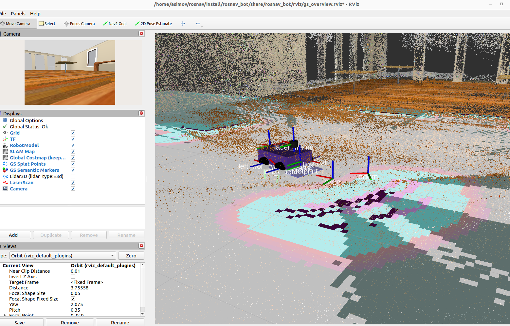

<p><sub>3D lidar point cloud · camera · costmap · Gaussian Splat semantic markers — all in one RViz config (<code>rviz/gs_overview.rviz</code>)</sub></p>

</div>

One launch → Gazebo + SLAM/Nav2 + RViz. Scale to a fleet with one arg. Humble/Jazzy params auto-selected from `$ROS_DISTRO`.

Deep dive → [`concepts.md`](concepts.md) · launch args → `ros2 launch rosnav_bot <file> --show-args`

---

<details>
<summary><h2>Contents</h2></summary>

**Core**
- [1. Install](#1-install) (incl. [Docker](#docker-alternative-to-the-install-above))
- [2. Map · save · navigate](#2-map--save--navigate)
- [3. Fleet & explore](#3-fleet--explore)

**Features**
- [4. Dynamic obstacles](#4-dynamic-obstacles)
- [5. YOLO object detection](#5-yolo-object-detection)
- [6. ArUco docking](#6-aruco-docking)
- [7. LLM voice navigation](#7-llm-voice-navigation)

**Platforms & tuning**
- [8. Platforms — drive bases, chassis skins, how to switch](#8-platforms--drive-bases-chassis-skins-how-to-switch)
- [9. Controllers, SLAM backends & benchmarking](#9-controllers-slam-backends--benchmarking)
- [10. Worlds](#10-worlds)
- [11. Update YAML (tuning)](#11-update-yaml-tuning)

**Fleet & multi-robot**
- [12. Open-RMF](#12-open-rmf)
- [13. Fleet CLI](#13-fleet-cli)

**Research / advanced**
- [14. Gaussian Splatting capture](#14-gaussian-splatting-capture)
- [15. AI training (YOLO · Gaussian Splat keepout · RL)](#15-ai-training-yolo--gaussian-splat-keepout--rl)

**Reference**
- [16. Fixes](#16-fixes)

</details>

---

## 1. Install

```bash
# Ubuntu 22.04 / Humble — use jazzy on 24.04
sudo apt install -y \
  ros-humble-ros-gz ros-humble-ros-gz-bridge \
  ros-humble-xacro ros-humble-joint-state-publisher \
  ros-humble-nav2-bringup ros-humble-slam-toolbox \
  ros-humble-navigation2 ros-humble-teleop-twist-keyboard \
  ros-humble-laser-filters ros-humble-rviz2
# optional SLAM backends:
#   sudo apt install ros-humble-rtabmap-ros ros-humble-cartographer-ros

git clone https://github.com/darshmenon/rosnav.git ~/rosnav
cd ~/rosnav && colcon build --symlink-install
source /opt/ros/humble/setup.bash && source install/setup.bash
```

### Docker (alternative to the install above)

```bash
xhost +local:root   # allow container GUI (Gazebo/RViz) to reach the host X server
docker compose up --build rosnav
# inside the container:
ros2 launch rosnav_bot slam_nav.launch.py world_name:=hospital explore:=true
```

`docker-compose.yml` bind-mounts `src/` so host edits are picked up without a
full image rebuild (just re-`colcon build` inside the container). See
[`docker/orb_slam3/README.md`](docker/orb_slam3/README.md) for the separate
ORB-SLAM3 visual-SLAM sidecar (§9 below has more on comparing SLAM backends).

---

## 2. Map · save · navigate

### A — Drive with teleop (build the map)

```bash
# Terminal 1 — SLAM only (no frontier). Keep safety:=true so /cmd_vel reaches Gazebo.
ros2 launch rosnav_bot slam_nav.launch.py world_name:=hospital

# Terminal 2 — keyboard drive
ros2 run teleop_twist_keyboard teleop_twist_keyboard
```

Keys: `i` forward · `,` back · `j`/`l` turn · `k` stop · `q`/`z` speed.  
Watch the map in RViz (`Map` on `/map`), or:

```bash
ros2 topic hz /scan          # ~10 Hz
ros2 topic hz /odom          # ~50 Hz
ros2 topic echo /map --once --field info    # width/height should grow
# Optional: watch / reject malformed scans (on by default in slam_nav via scan_gate:=true)
ros2 run rosnav_bot scan_quality_gate.py --ros-args -p use_sim_time:=true
```

Or let the robot explore alone: add `explore:=true` to the launch above.

Exploration backend defaults to `explore_lite` (most reliable unattended — see
`concepts.md` §9 for a full comparison). Switch it with `explorer:=`:

```bash
ros2 launch rosnav_bot slam_nav.launch.py world_name:=hospital explore:=true explorer:=builtin
# explorer:=builtin | explore_lite (default) | frontier | rrt
```

How `explorer:=builtin` actually picks a goal, step by step: https://claude.ai/code/artifact/bcce2ab9-74e1-4472-9eab-50d33daacfda
(private Claude artifact — share it from the page's share menu if this needs to be readable without your account)

`explorer:=builtin` extras (`concepts.md` §9 for details):
- `exploration_boundary:="x1,y1,x2,y2,..."` — confine frontiers to a map-frame polygon
- `resume_session:=true` — continue from the last visited-frontier checkpoint
  (`<map_prefix>_session.json`, written automatically every 10 goals) instead of starting fresh
- `info_gain_mode:=fov` (with `frontier_scorer:=weighted`) — sensor-cone info gain instead of
  the default fixed-radius `ring`; tune with `info_gain_fov`/`info_gain_max_depth`

### B — Save the map

```bash
ros2 run nav2_map_server map_saver_cli -f src/rosnav_bot/maps/map_hospital
```

Writes `map_hospital.yaml` + `map_hospital.pgm`. Then `Ctrl+C` the SLAM launch.  
(With `explore:=true`, maps also autosave under `src/rosnav_bot/maps/map_<world>.*`.)

### C — Navigate on the saved map

```bash
ros2 launch rosnav_bot robot.launch.py world_name:=hospital \
  map:=src/rosnav_bot/maps/map_hospital.yaml
```

AMCL localizes on the static map — no more SLAM. Send a goal:

**RViz**  
1. Fixed Frame = `map`  
2. **2D Pose Estimate** — seed AMCL if particles are wide  
3. **2D Goal Pose** — click+drag the goal  

**CLI**
```bash
ros2 action send_goal /navigate_to_pose nav2_msgs/action/NavigateToPose \
  "{pose: {header: {frame_id: map}, pose: {position: {x: 2.0, y: -1.0}, orientation: {w: 1.0}}}}"

ros2 run rosnav_bot fleet_manager.py goto '' 2.0 -1.0    # single robot
ros2 run rosnav_bot fleet_manager.py goto robot1 room_a  # named location
```

Goal accepted but no motion? Keep `safety:=true` (Nav2 `/cmd_vel` → Gazebo `/cmd_vel_safe`).

Multi-SLAM (`slam_mode:=multi`): save `/map_merged` with `-t /map_merged` or `fleet_manager.py savemap`.

<p align="center">
  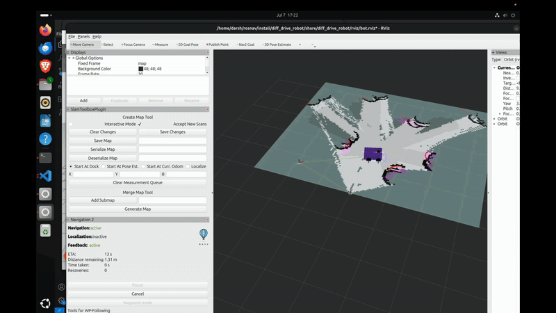
  <br/><sub>Single-robot SLAM · Nav2 · frontier exploration</sub>
</p>

---

## 3. Fleet & explore

```bash
ros2 launch rosnav_bot slam_nav.launch.py world_name:=hospital explore:=true
ros2 launch rosnav_bot multi_robot.launch.py robot_count:=2
ros2 launch rosnav_bot multi_robot.launch.py fleet_mgmt:=true
ros2 launch rosnav_bot multi_robot.launch.py slam_mode:=multi      # → /map_merged, drift-corrected via collab_loop_closure
ros2 launch rosnav_bot multi_robot.launch.py slam_mode:=multi collab_loop_closure:=false  # static known-pose merge only
ros2 launch rosnav_bot multi_robot.launch.py slam_mode:=multi lidar_type:=3d slam_algo:=3d rviz:=true  # RTAB-Map 3D SLAM, view cloud_map in RViz
ros2 launch rosnav_bot multi_robot.launch.py merge_scans:=true     # → /map_fused

ros2 launch rosnav_bot slam_nav.launch.py world_name:=hospital safety:=true
ros2 run rosnav_bot mission_server.py patrol robot1 1,2,0 3,4,90
ros2 run rosnav_bot coverage_planner.py
```

<table align="center">
  <tr>
    <td align="center"><b>3D SLAM, collab loop closure</b></td>
    <td align="center"><b>Coordinated exploration</b></td>
  </tr>
  <tr>
    <td>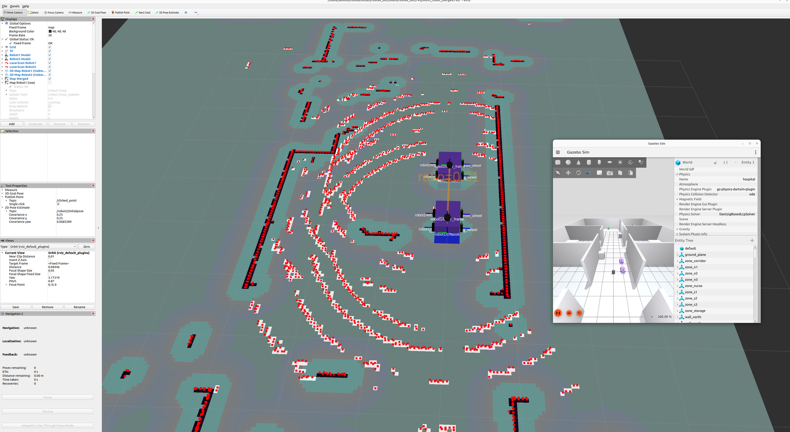</td>
    <td>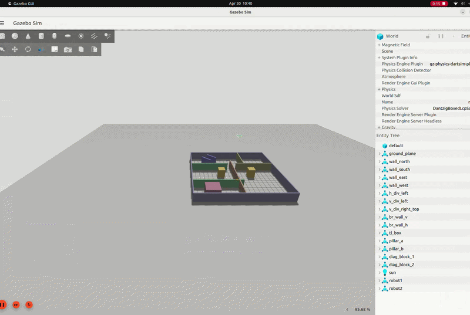</td>
  </tr>
</table>

<p><sub>slam_mode:=multi lidar_type:=3d slam_algo:=3d — per-robot rtabmap cloud_map + accepted collab_loop_closure correction</sub></p>

---

## 4. Dynamic obstacles

Spawn a patrolling obstacle to test avoidance and [`obstacle_tracker.py`](concepts.md#25-moving-obstacle-tracking-obstacle_trackerpy) against a moving object, not just static walls.

```bash
ros2 launch rosnav_bot slam_nav.launch.py world_name:=maze dynamic_obstacles:=1
ros2 launch rosnav_bot multi_robot.launch.py dynamic_obstacles:=2 dynamic_obstacle_axis:=x_axis

ros2 run rosnav_bot obstacle_tracker.py    # watch it get tracked
```

Details → [concepts.md §26](concepts.md#26-dynamic-obstacles-dynamic_obstacle_driverpy).

---

## 5. YOLO object detection

Needs: `pip install ultralytics`. Camera is enabled automatically with `enable_yolo:=true`.

```bash
ros2 launch rosnav_bot slam_nav.launch.py world_name:=warehouse enable_yolo:=true

# Tune
ros2 launch rosnav_bot slam_nav.launch.py world_name:=warehouse enable_yolo:=true \
  yolo_model:=yolov8n.pt yolo_confidence:=0.6 yolo_classes:=person,chair
```

Topics: `yolo/detections` · `yolo/image_annotated`

Stock `yolov8n.pt` (COCO) detects nothing in stylized sim worlds like `cafe` — fine-tune on collected sim frames:

```bash
ros2 launch rosnav_bot slam_nav.launch.py world_name:=cafe enable_rgbd:=true explore:=true
# auto-labeled (no manual annotation) for cafe's 5 known table poses:
ros2 run rosnav_bot yolo_collect.py --ros-args \
  -p out_dir:=$HOME/yolo_data/cafe_auto -p classes:=table -p map_frame:=odom \
  -p auto_label_config:=$(pwd)/src/rosnav_bot/config/yolo_auto_label_cafe.yaml \
  -p max_frames:=200 -p use_sim_time:=true
python3 src/rosnav_bot/scripts/yolo_train.py --data $HOME/yolo_data/cafe_auto/dataset.yaml --epochs 50
```

Details (why `map_frame:=odom`, not the default `map`) → [concepts.md §35-A](concepts.md#35-ai-training-pipelines-yolo--gs-keepout--rl).

---

<p align="center">
  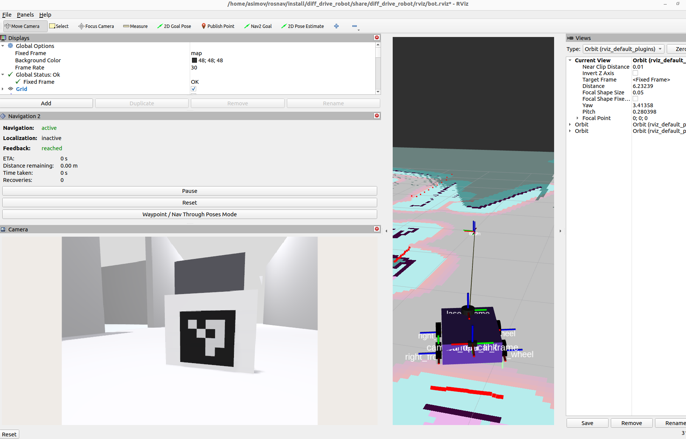
  <br/><sub>ArUco visual docking</sub>
</p>

## 6. ArUco docking

Needs: `enable_camera:=true` and `sudo apt install ros-humble-cv-bridge python3-opencv`. Hospital world has the dock marker.

```bash
ros2 launch rosnav_bot slam_nav.launch.py world_name:=hospital enable_camera:=true rviz:=true

ros2 run rosnav_bot fleet_manager.py dock '' charging_dock
ros2 run rosnav_bot fleet_manager.py undock '' 0.5 0.05

# Visual approach only (skip Nav2 staging)
ros2 run rosnav_bot aruco_dock.py --ros-args -p dock_name:=charging_dock
```

Dock poses / marker IDs → `config/docks.yaml`. Live view: `/tmp/aruco_dock_view.jpg` or RViz `Image` on `/camera/image_raw`.

---

## 7. LLM voice navigation

Needs: `ollama serve` and a pulled model (`ollama pull llama3.1`). Start the nav stack first. `station_server.py` exposes dock/undock/status as ROS 2 actions so the planner can chain them.

```bash
ros2 launch rosnav_bot slam_nav.launch.py world_name:=hospital enable_camera:=true

ros2 run rosnav_bot station_server.py
ros2 run rosnav_bot llm_nav.py
# type or speak: go to room_b · stop
# multi-step: undock, go to room_b, then come back and dock

# Text only (no mic)
ros2 topic pub /llm_nav/command std_msgs/msg/String \
  "data: 'undock, go to room_b, then come back and dock'" --once
```

Named places → `config/locations.yaml`. Docks → `config/docks.yaml`. Replies also publish on `/llm_nav/reply`.

Manual station actions (no LLM):

```bash
ros2 service call /get_robot_status rosnav_bot/srv/GetRobotStatus
ros2 action send_goal /dock_to_station rosnav_bot/action/DockToStation "{station: charging_dock}"
ros2 action send_goal /undock_from_station rosnav_bot/action/UndockFromStation "{}"
```

---

## 8. Platforms — drive bases, chassis skins, how to switch

Two independent launch args:

| Arg | What it changes | Values |
|---|---|---|
| `drive_type` | Physics + Gazebo plugin + Nav2 params (how it moves) | `diff` (default) · `mecanum` · `ackermann` |
| `robot_model` | Chassis **visual** only (same footprint / wheels / Nav2) | `custom` (default) · `mir100` · `husky` |

`mir100` / `husky` only work with `drive_type:=diff`. Mixing them with mecanum/ackermann is ignored (with a warning).

| Platform | Launch knobs | Motion | Notes |
|---|---|---|---|
| Diff box (default) | `drive_type:=diff` | Forward + turn in place | DWB (Humble, default) · MPPI (`controller:=mppi`) · RPP (`controller:=rpp`) |
| Mecanum | `drive_type:=mecanum` | Holonomic — can strafe (`vy`) | Nav2 unlocks `max_vel_y`; no pre-rotate |
| Ackermann (car-like) | `drive_type:=ackermann` | Front steer, min turning radius ~0.66 m | Always MPPI; keep `safety:=true` |
| MiR100 look | `robot_model:=mir100` (+ diff) | Same as diff | Mesh skin only |
| Husky look | `robot_model:=husky` (+ diff) | Same as diff | Mesh skin only |

### Switch (single robot — map + navigate)

```bash
# Diff (default)
ros2 launch rosnav_bot slam_nav.launch.py world_name:=hospital drive_type:=diff explore:=true

# Holonomic
ros2 launch rosnav_bot slam_nav.launch.py world_name:=hospital drive_type:=mecanum explore:=true

# Car-like
ros2 launch rosnav_bot slam_nav.launch.py world_name:=hospital drive_type:=ackermann explore:=true safety:=true

# Same drive, different look
ros2 launch rosnav_bot slam_nav.launch.py world_name:=hospital robot_model:=mir100
ros2 launch rosnav_bot slam_nav.launch.py world_name:=hospital robot_model:=husky

# Navigate on a saved map (same args work on robot.launch.py)
ros2 launch rosnav_bot robot.launch.py world_name:=hospital \
  map:=src/rosnav_bot/maps/map_hospital.yaml drive_type:=ackermann safety:=true
```

### Switch (fleet)

```bash
ros2 launch rosnav_bot multi_robot.launch.py drive_type:=mecanum
ros2 launch rosnav_bot multi_robot.launch.py drive_type:=ackermann
ros2 launch rosnav_bot multi_robot.launch.py robot_model:=mir100
ros2 launch rosnav_bot multi_robot.launch.py robot_model:=husky
```

---

## 9. Controllers, SLAM backends & benchmarking

### Controllers & sensors (orthogonal)

```bash
# MPPI or RPP instead of DWB (Humble; Jazzy already defaults to MPPI). Ackermann always MPPI.
ros2 launch rosnav_bot slam_nav.launch.py world_name:=hospital controller:=mppi explore:=true
ros2 launch rosnav_bot slam_nav.launch.py world_name:=hospital controller:=rpp explore:=true

# UKF instead of EKF for the wheel-odom+IMU fusion filter (odom->base_link TF)
ros2 launch rosnav_bot slam_nav.launch.py localization_filter:=ukf explore:=true

# slam_toolbox run mode (slam_algo:=2d only): online_async (default) | online_sync | lifelong
ros2 launch rosnav_bot slam_nav.launch.py slam_toolbox_mode:=online_sync explore:=true

# 3D lidar / RTAB-Map (diff only)
ros2 launch rosnav_bot slam_nav.launch.py lidar_type:=3d
ros2 launch rosnav_bot slam_nav.launch.py lidar_type:=3d slam_algo:=3d explore:=true

# More SLAM backends (same Nav2 stack)
ros2 launch rosnav_bot slam_nav.launch.py slam_algo:=cartographer explore:=true   # needs cartographer-ros
ros2 launch rosnav_bot slam_nav.launch.py slam_algo:=vslam world_name:=cafe explore:=true
ros2 launch rosnav_bot slam_nav.launch.py slam_algo:=multisensor explore:=true    # RGB-D + lidar
ros2 launch rosnav_bot slam_nav.launch.py lidar_type:=3d slam_algo:=multisensor explore:=true

# ORB-SLAM3 (feature-based VSLAM — tracker runs in a separate Docker/bare-metal
# process, see docker/orb_slam3/README.md and concepts.md §3)
ros2 launch rosnav_bot slam_nav.launch.py slam_algo:=orbslam3 world_name:=cafe explore:=true
docker compose up orb_slam3    # separate terminal
```

**Live demo** — all four windows at once: Gazebo (top-left), RViz's `/map` + costmap (bottom-left),
ORB-SLAM3's Map Viewer top-down point cloud (top-right), and Current Frame tracked-feature overlay
(bottom). Needs GTK-enabled OpenCV for the viewer windows — see
`docker/orb_slam3/params/rosnav_rgbd_ros_params.yaml`.

<table align="center">
  <tr>
    <td align="center"><b>Early in the run</b></td>
    <td align="center"><b>Later — denser map, tracking a shelf</b></td>
  </tr>
  <tr>
    <td>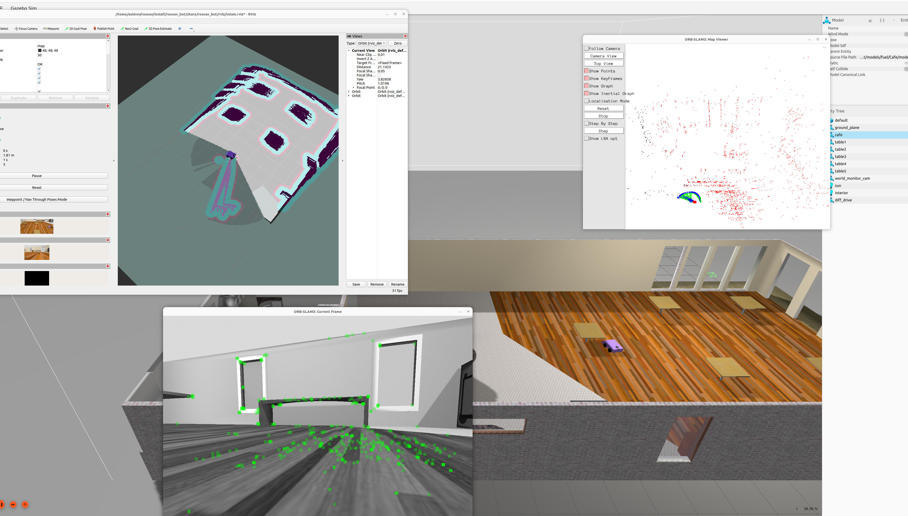</td>
    <td>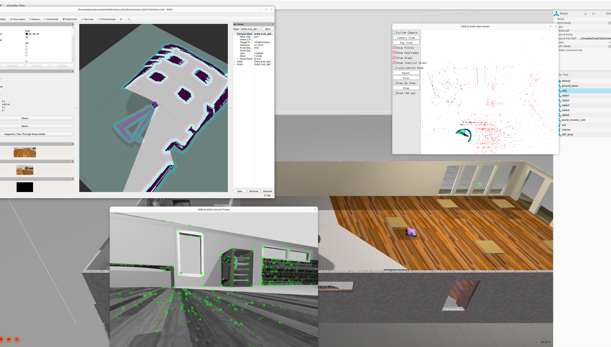</td>
  </tr>
</table>

<details open>
<summary>Closer look at the two ORB-SLAM3 viewer windows individually</summary>

<table align="center">
  <tr>
    <td align="center"><b>Current Frame (923/1200 matched)</b></td>
    <td align="center"><b>Map Viewer (top-down)</b></td>
  </tr>
  <tr>
    <td>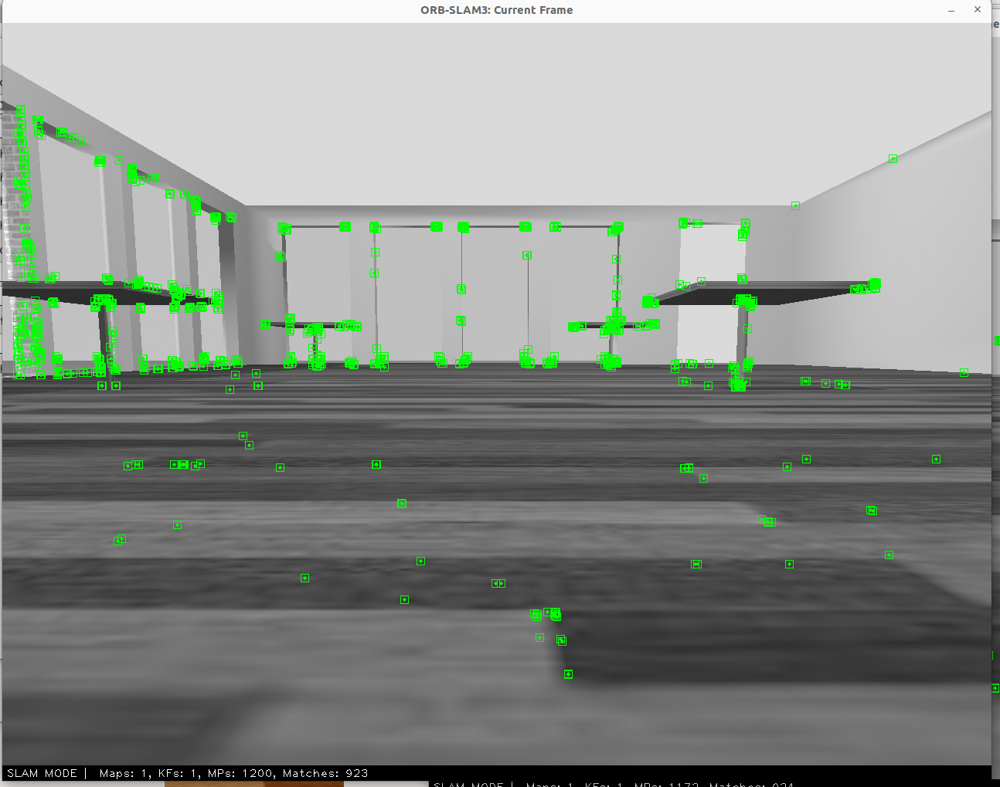</td>
    <td>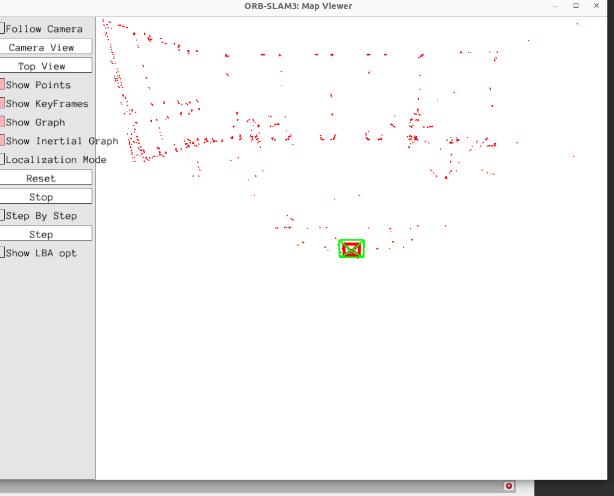</td>
  </tr>
  <tr>
    <td colspan="2" align="center"><b>Keyframe pose-graph</b> (blue = keyframes, green = covisibility edges, red = current camera)</td>
  </tr>
  <tr>
    <td colspan="2" align="center">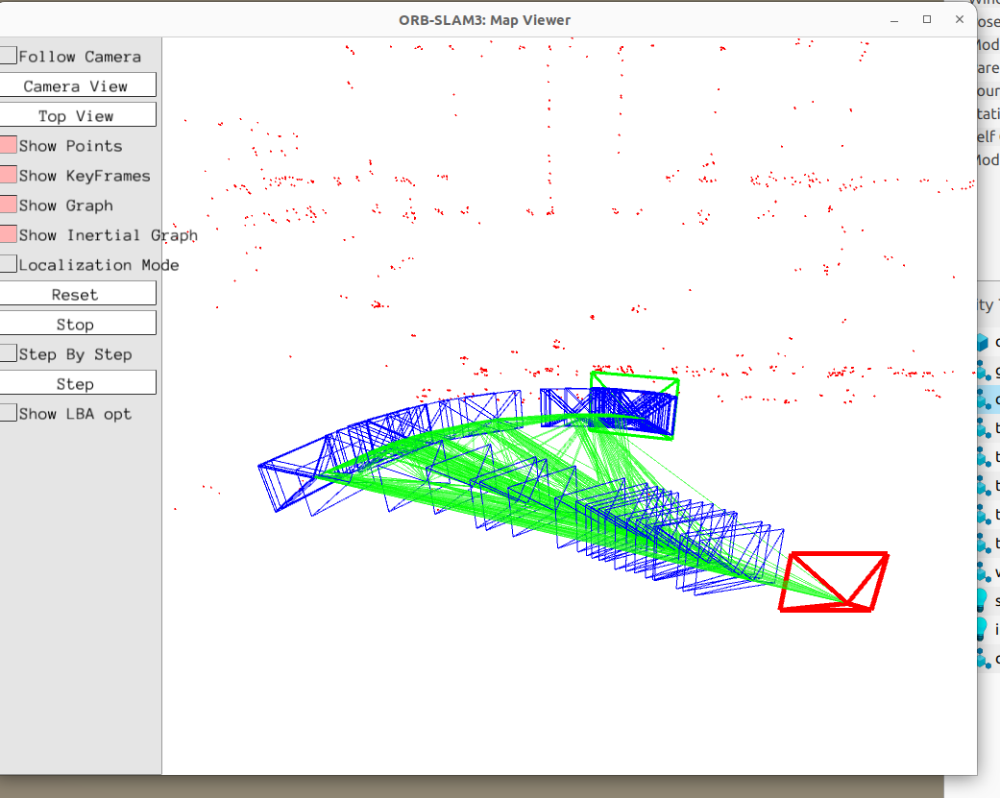</td>
  </tr>
</table>

</details>

**All SLAM backends in this repo**, at a glance (full comparison → `concepts.md` §3):

| `slam_algo:=` | Package | Sensors | Native / sidecar |
|---|---|---|---|
| `2d` (default) | slam_toolbox | 2D lidar | Native (apt) |
| `cartographer` | Cartographer | 2D lidar + IMU | Native (apt) |
| `3d` | RTAB-Map | 3D lidar + RGB | Native (apt) |
| `vslam` | RTAB-Map | RGB-D | Native (apt) |
| `multisensor` | RTAB-Map | RGB-D + lidar | Native (apt) |
| `cslam` | Swarm-SLAM | 3D lidar (fleet) | Native (`link_third_party.sh --cslam`) |
| `orbslam3` | ORB-SLAM3 | RGB-D | Tracker: Docker sidecar / bare-metal (`docker/orb_slam3/`); grid: native bridge node |

In RViz (`slam_explore.rviz`): "Local Plan" shows whichever controller's selected
path; enable "MPPI Candidate Trajectories" (off by default) when `controller:=mppi`
to see the sampled velocity rollouts it's scoring; "SLAM Pose Graph" shows
slam_toolbox's nodes + loop-closure constraints live; "Fused Odom (EKF/UKF)" vs
"Wheel Odom (raw)" (off by default) lets you watch the localization filter correct
drift, with its position-covariance ellipse on.

### Controller / localization-filter / SLAM-mode benchmark

Exploration-backend (`builtin`/`explore_lite`/`frontier`/`rrt`) coverage/accuracy comparisons
live in `EXPLORATION_TESTING_NOTES.md` (repo-local, not committed).

`benchmark.py mode:=nav|accuracy|slam` + `mode:=report` compares any of the
above numerically and writes a self-contained HTML dashboard. Local chart
generation is available from the reporting scripts but is intentionally kept
out of this README — see concepts.md §3/§6b/§7 for the full run/compare
walkthrough (controller: dwb/mppi/rpp via `mode:=nav`; EKF/UKF via
`mode:=accuracy`; slam_toolbox_mode via `mode:=slam`).

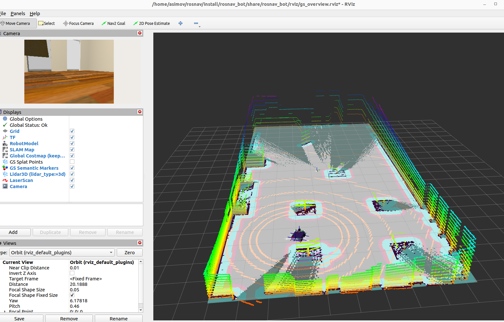

RTAB-Map (`slam_algo:=3d`) with the OctoMap voxel layer, live during frontier
exploration in `maze`:

<table align="center">
  <tr>
    <td align="center"><b>Near the start</b></td>
    <td align="center"><b>Later — more of the maze mapped</b></td>
  </tr>
  <tr>
    <td>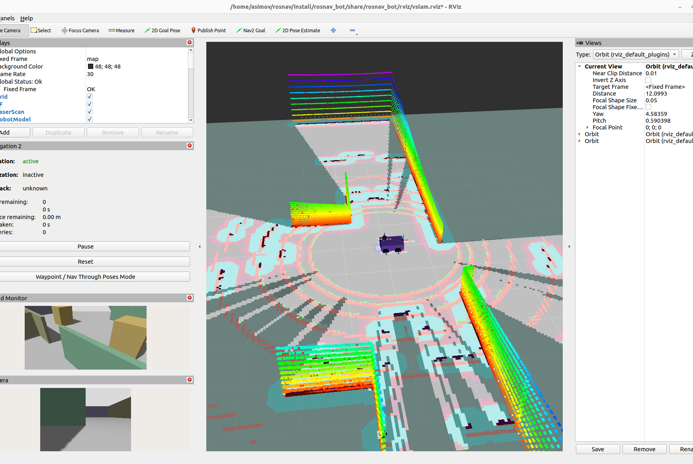</td>
    <td>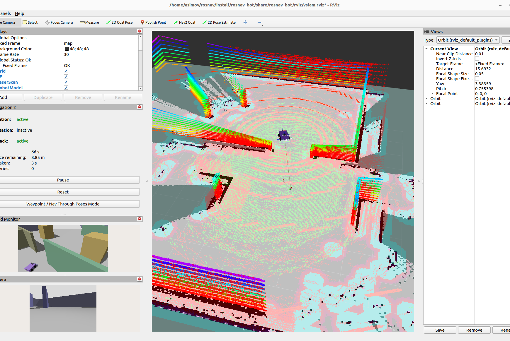</td>
  </tr>
</table>

### SLAM benchmark (headless compare)

```bash
# Default matrix: 2d | cartographer | vslam | multisensor | 3d  (maze, 120s explore)
./src/rosnav_bot/scripts/benchmark_slam.sh
WORLD=hospital DURATION_S=90 ALGOS="2d cartographer multisensor" ./src/rosnav_bot/scripts/benchmark_slam.sh
# → /tmp/rosnav_slam_bench/<stamp>/comparison.md (+ per-algo summary.json / map.*)
```

Install Cartographer once if you want that row:
`sudo apt install ros-${ROS_DISTRO}-cartographer-ros`

Strafe example (mecanum):
```bash
ros2 topic pub -r 20 /cmd_vel_safe geometry_msgs/msg/Twist \
  "{linear: {x: 0.0, y: 0.3, z: 0.0}, angular: {x: 0.0, y: 0.0, z: 0.0}}"
```

Ackermann steer-while-driving:
```bash
ros2 topic pub -r 20 /cmd_vel_safe geometry_msgs/msg/Twist \
  "{linear: {x: 0.4, y: 0.0, z: 0.0}, angular: {x: 0.0, y: 0.0, z: 0.3}}"
```

Deep dive → [concepts.md §18–20](concepts.md#18-mecanum-holonomic-drive) (mecanum / ackermann / MiR100 / Husky).

### Headless smoke (all AMRs map + move)

```bash
# Gazebo server only — no GUI. Checks /odom /scan /map and a short drive per platform.
./src/rosnav_bot/scripts/smoke_amr_matrix.sh
# optional filters:
#   WORLD=maze BOOT_WAIT_S=50 ./src/rosnav_bot/scripts/smoke_amr_matrix.sh
#   ONLY=ackermann,diff_husky ./src/rosnav_bot/scripts/smoke_amr_matrix.sh
```

Stop other Gazebo/ROS sims first — parallel `gz sim` instances starve DDS and make later variants fail.

---

## 10. Worlds

| | |
|---|---|
| Indoor | `hospital` `house` `office` `warehouse` `maze` `corridor` `obstacles` |
| Special | `empty` · `warehouse_depot` (`scripts/download_depot_model.sh` if needed) |
| Terrain-friction benchmark | `multi_terrain_robot_diff` — 4 zones (concrete/asphalt/gravel/low-friction tile), see §36-37 in concepts.md |
| No map yet | `outdoor` `multi_terrain` — use `explore:=true` |

```bash
ros2 launch rosnav_bot slam_nav.launch.py world_name:=warehouse explore:=true
ros2 launch rosnav_bot multi_robot.launch.py world:=house
```

**Terrain-aware speed costmap** (§36-37) — the robot's 2D lidar has no terrain semantics, so this slows it down via a Nav2 SpeedFilter mask instead, either baked from the world's SDF friction values or driven live from the RGB-D camera:

```bash
# Static, ground-truth mask baked from the world file's <mu> friction values:
ros2 run rosnav_bot gen_terrain_speed_mask.py \
    --world src/rosnav_bot/worlds/multi_terrain_robot_diff.world \
    --align-to src/rosnav_bot/maps/map_multi_terrain_robot_diff.yaml \
    --out src/rosnav_bot/maps/terrain_speed_multi_terrain_robot_diff.yaml
ros2 launch rosnav_bot slam_nav.launch.py world_name:=multi_terrain_robot_diff explore:=true \
    gs_speed_mask:=src/rosnav_bot/maps/terrain_speed_multi_terrain_robot_diff.yaml

# Live, camera-driven mask (heuristic depth-roughness proxy — no static file needed):
ros2 launch rosnav_bot slam_nav.launch.py world_name:=multi_terrain_robot_diff explore:=true \
    terrain_live_camera:=true
```

---

## 11. Update YAML (tuning)

All configs live under `src/rosnav_bot/config/`. With `--symlink-install`, edit then **relaunch** (no rebuild).

| Want to change… | Edit |
|---|---|
| Named places (`room_a`, `goto`) | `locations.yaml` |
| ArUco dock ID / staging / stand-off | `docks.yaml` |
| Nav2 speeds, footprint, costmaps (diff, Humble) | `nav2_params.yaml` |
| Same on Jazzy | `nav2_params_jazzy.yaml` |
| MPPI / mecanum / ackermann | `nav2_params_mppi.yaml` · `nav2_params_mecanum.yaml` · `nav2_params_ackermann.yaml` |
| Multi-robot Nav2 | `nav2_multirobot_params.yaml` (+ `_jazzy`) |
| SLAM Toolbox | `mapper_params_online_async.yaml` · `mapper_params_per_robot.yaml` |
| RMF lanes / fleet policy | `rmf_fleet.yaml` |
| Keep-out zones | `no_go_zones.yaml` |

```bash
# locations.yaml — then: ros2 run rosnav_bot fleet_manager.py goto '' kitchen
#   kitchen: {x: 3.0, y: -1.5, yaw: 0.0}

# nav2_params.yaml — raise speed:
#   controller_server → FollowPath → max_vel_x: 0.5

source install/setup.bash
ros2 launch rosnav_bot slam_nav.launch.py world_name:=hospital explore:=true
```

Maps: `src/rosnav_bot/maps/map_<world>.yaml` (+ `.pgm`) · use `map:=...` on launch.  
More → [`concepts.md`](concepts.md).

---

## 12. Open-RMF

```bash
ros2 launch rosnav_bot multi_robot.launch.py explore:=false robot_count:=2
ros2 launch rosnav_bot rmf_fleet.launch.py robot_count:=2 docking:=noop
ros2 run rosnav_bot rmf_submit_task.py patrol room_a room_b --rounds 2
```

Details → [concepts.md §11b](concepts.md#11b-open-rmf-traffic-scheduling-experimental).

---

## 13. Fleet CLI

```bash
ros2 run rosnav_bot fleet_manager.py list|status|health
ros2 run rosnav_bot fleet_manager.py goto robot1 room_a
ros2 run rosnav_bot fleet_manager.py teleop robot1
ros2 run rosnav_bot fleet_manager.py savemap src/rosnav_bot/maps/map_hospital
ros2 run rosnav_bot fleet_manager.py mission robot1 patrol room_a room_b
ros2 run rosnav_bot fleet_manager.py tasks add 2.0 1.5 0 pickup_A
ros2 run rosnav_bot fleet_gui.py
ros2 run rosnav_bot multi_teleop.py
```

---

## 14. Gaussian Splatting capture

Feasibility spike: capture a photo set + exact Gazebo-ground-truth poses for [3D Gaussian Splatting](https://docs.nerf.studio/nerfology/methods/splat.html) — no robot, no COLMAP.

<table align="center">
  <tr>
    <td align="center"><b>Reconstruction fly-through</b></td>
    <td align="center"><b>Fully trained splat, training view</b></td>
  </tr>
  <tr>
    <td>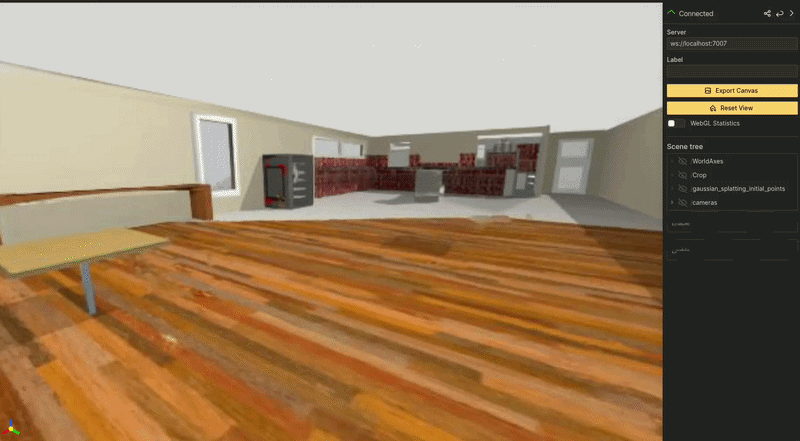</td>
    <td>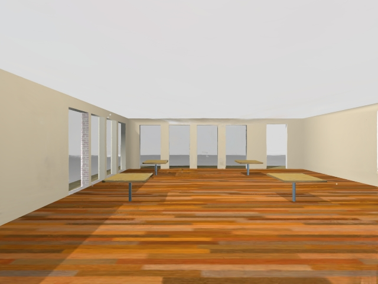</td>
  </tr>
</table>

<p align="center"><sub>cafe.world, fully trained splat — 384 captured frames, 30k splatfacto iterations</sub></p>

### A — Capture

```bash
# Gazebo (headless) + the teleportable capture rig, no robot/nav stack
ros2 launch rosnav_bot gs_capture.launch.py world_name:=cafe

# Sweep the waypoint grid, write nerfstudio-format data
ros2 run rosnav_bot gs_capture.py --ros-args \
  -p world_name:=cafe -p out_dir:=/home/asimov/gs_data/cafe
```

### B — Train + view (separate nerfstudio venv)

```bash
source ~/venvs/nerfstudio/bin/activate
ns-train splatfacto --data /home/asimov/gs_data/cafe --pipeline.model.random-init True nerfstudio-data
ns-viewer --load-config outputs/.../splatfacto/<timestamp>/config.yml   # → http://localhost:7007
```

<table align="center">
  <tr>
    <td align="center"><b>Ground truth (Gazebo)</b></td>
    <td align="center"><b>Trained splat — RGB</b></td>
    <td align="center"><b>Trained splat — depth</b></td>
  </tr>
  <tr>
    <td>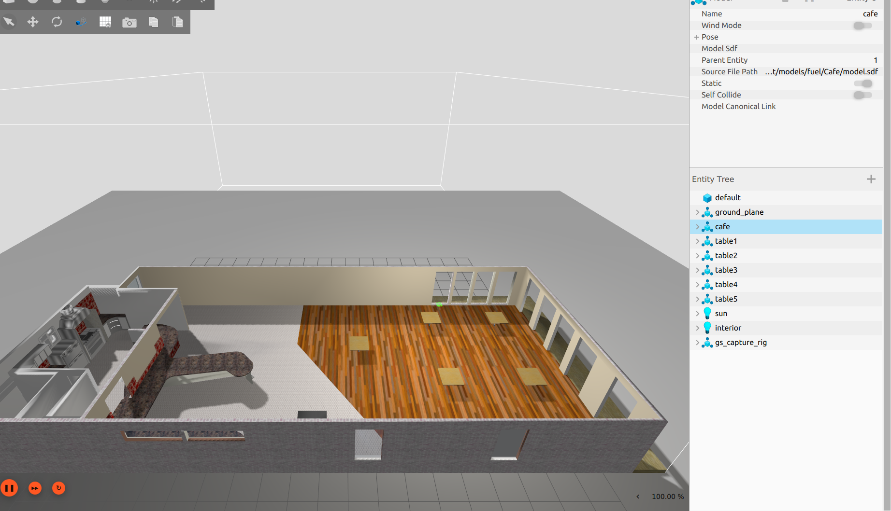</td>
    <td></td>
    <td>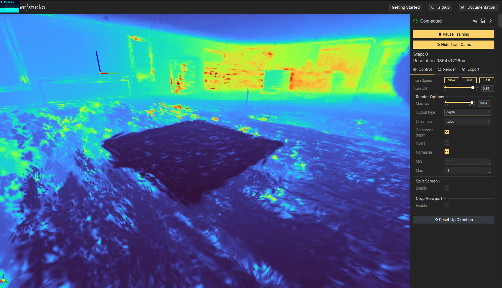</td>
  </tr>
  <tr>
    <td colspan="3">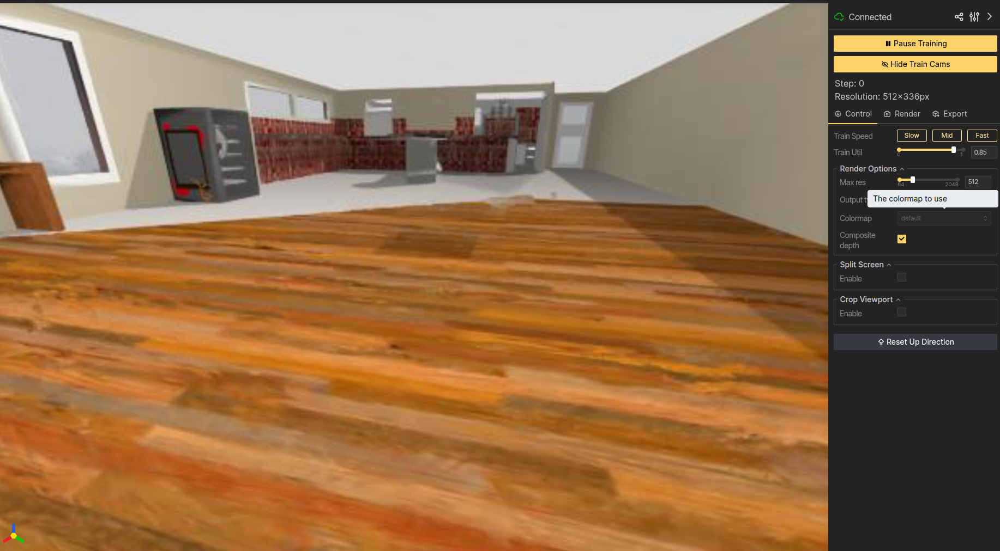</td>
  </tr>
</table>

<p align="center"><sub>cafe.world capture, viewed live in the nerfstudio browser viewer — depth confirms geometry, not just color, is coherent</sub></p>

### C — Or view in RViz instead (Gaussian centers as a colored point cloud)

```bash
# Still in the nerfstudio venv
ns-export gaussian-splat --load-config outputs/.../splatfacto/<timestamp>/config.yml --output-dir splat_export/
# --dataparser-transform is required — without it xyz stays in nerfstudio's
# training-normalized space (~4.5x too small vs. true Gazebo-world meters on
# a real capture), not the file ns-export itself writes; see concepts.md §29b.
python3 src/rosnav_bot/scripts/gs_splat_to_pointcloud.py splat_export/splat.ply splat_points.npz \
    --dataparser-transform outputs/.../splatfacto/<timestamp>/dataparser_transforms.json
deactivate

# Back in the ROS 2 environment
ros2 run rosnav_bot gs_view_pointcloud.py --ros-args -p npz_path:=$(pwd)/splat_points.npz
rviz2 -d src/rosnav_bot/rviz/gs_capture.rviz

# Or the fuller overview config (splat + keepout/speed costmap + semantic
# markers + robot model in one view — see §27-29 in concepts.md):
rviz2 -d src/rosnav_bot/rviz/gs_overview.rviz
```

<table align="center">
  <tr>
    <td align="center"><b>GS splat point cloud (gs_overview.rviz)</b></td>
    <td align="center"><b>World-scaled, alongside robot + 3D lidar (§29b fix)</b></td>
  </tr>
  <tr>
    <td>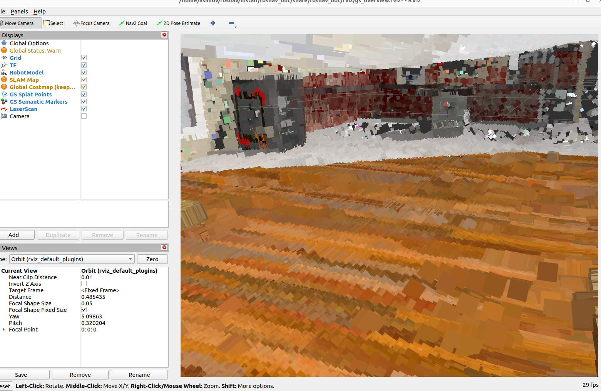</td>
    <td>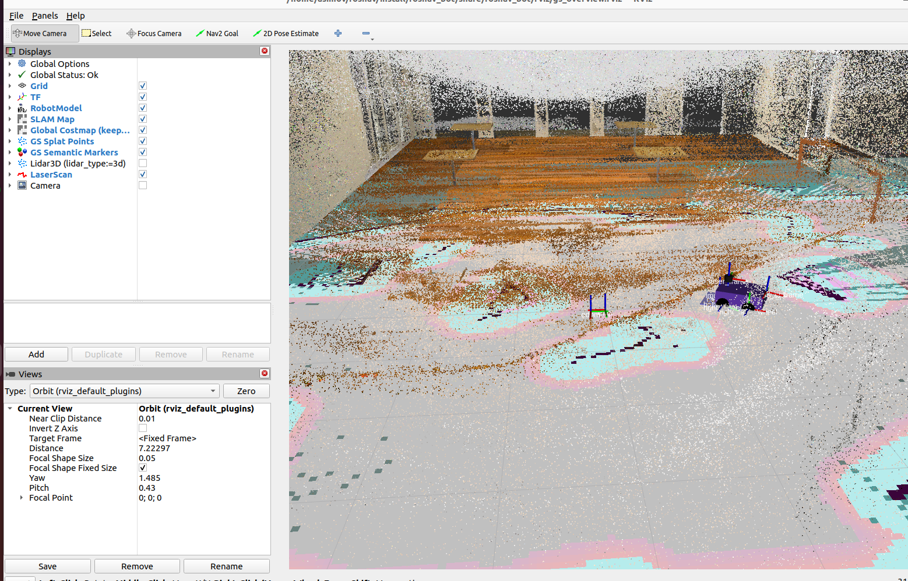</td>
  </tr>
</table>

**Navigation plan:** already wired for a static costmap layer — see [§28](concepts.md#28-gs-costmap-keepout-filter-gs_mask_from_splatpy) (`KeepoutFilter`) and [§30](concepts.md#30-gs-speed-costmap-filter-gs_speed_mask_from_splatpy) (`SpeedFilter`), both driven by `gs_mask_from_splat.py`/`gs_speed_mask_from_splat.py` rasterizing the same Gaussian point cloud into a Nav2 costmap filter mask.

Details → [concepts.md §27](concepts.md#27-gaussian-splatting-capture-rig-gs_capturepy).

---

## 15. AI training (YOLO · Gaussian Splat keepout · RL)

Three research pipelines that plug into the existing stack. Core SLAM/Nav2 stay classical.

### A — YOLO fine-tune

```bash
# Collect frames (camera up)
ros2 launch rosnav_bot slam_nav.launch.py world_name:=cafe enable_camera:=true
ros2 run rosnav_bot yolo_collect.py --ros-args -p out_dir:=$HOME/yolo_data/cafe -p max_frames:=200
# annotate labels/*.txt (YOLO format), then:
python3 src/rosnav_bot/scripts/yolo_train.py --data $HOME/yolo_data/cafe/dataset.yaml --epochs 50

# smoke (no Gazebo)
python3 src/rosnav_bot/scripts/yolo_train.py --smoke

# deploy
ros2 launch rosnav_bot slam_nav.launch.py enable_yolo:=true \
  yolo_model:=runs/detect/rosnav_yolo/weights/best.pt
```

### B — Gaussian Splat → Nav2 keepout

```bash
# full capture → ns-train → mask (needs nerfstudio venv)
bash src/rosnav_bot/scripts/gs_train_keepout.sh cafe

# or mask-only from an existing points.npz
MASK_ONLY=1 NPZ=$HOME/gs_data/cafe_points_final.npz \
  bash src/rosnav_bot/scripts/gs_train_keepout.sh cafe

ros2 launch rosnav_bot slam_nav.launch.py world_name:=cafe \
  gs_keepout_mask:=src/rosnav_bot/maps/gs_keepout_cafe.yaml
```

### C — RL local planner (PPO)

Trains offline on a map PGM (no Gazebo). Deploys as a research `/cmd_vel` source.

```bash
pip install stable-baselines3 gymnasium   # optional; default trainer is pure torch
python3 src/rosnav_bot/scripts/train_ppo.py --smoke
python3 src/rosnav_bot/scripts/train_ppo.py \
  --map src/rosnav_bot/maps/map_maze.yaml --timesteps 200000 --out runs/rl/ppo_maze

# with robot up (disable Nav2 controller or remap cmd_vel when testing)
ros2 run rosnav_bot rl_policy_node.py --ros-args \
  -p model_path:=runs/rl/ppo_maze/ppo_scan_nav.pt -p goal_x:=2.0 -p goal_y:=1.0
```

`train_ppo.py` defaults to a pure-PyTorch PPO (`--backend torch`). `--backend sb3` needs a working stable-baselines3 build.

---

## 16. Fixes

| Problem | Try |
|---|---|
| Plugin FATAL | Source the right `$ROS_DISTRO` |
| No motion | `ros2 topic hz /cmd_vel` · keep `safety:=true` |
| Map not saved | `explore:=true` · multi-SLAM: `-t /map_merged` |
| TF / no frontiers | Kill stale `gz` / `ros2` processes · cold-start deadlock and 3D-lidar leaked/unreachable frontiers are fixed (goal_pullback relaxes on a tiny known-free region; suspicious oversized clusters behind thin walls are penalized) — see `frontier_coordinator.py` / `frontier_explorer.py` |
| Invisible robots | `colcon build --symlink-install && source install/setup.bash` |
| YAML change ignored | Symlink install + relaunch; edit the correct Humble/Jazzy / drive-type file |
| Dock sees nothing | Set `enable_camera:=true` |
| YOLO missing | `pip install ultralytics` |
| LLM fails | `ollama serve` + `ollama pull llama3.1` · start `station_server.py` for dock/undock |

---

```
Fleet mgmt  →  Nav2 + SLAM/AMCL  →  Gazebo Harmonic + ros-gz bridge
```

<div align="center">

Made by [@darshmenon](https://github.com/darshmenon) · [Blog](https://medium.com/@darshmenon02/mastering-ros-2-navigation-from-slam-mapping-to-autonomous-obstacle-avoidance-7446e4ff049a) · [concepts.md](concepts.md)

</div>
